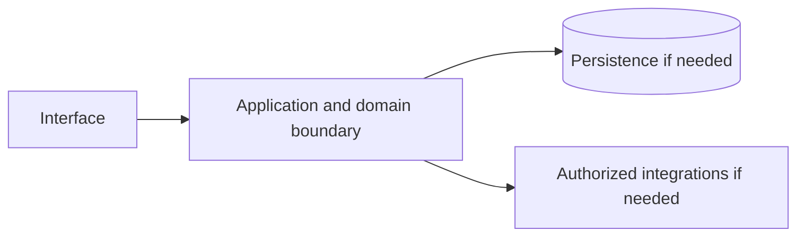

# Android — implementation skill (`android`)

> **Research status:** researched. Alternative coverage is **partial alternative coverage**; this describes candidate research only and does not determine whether your agent can build the product. Dossier prose, capability labels and source URLs are not automatically verified. The compiler does not fetch websites or candidate source and does not infer undocumented behavior.

> This is the coding-agent build skill for **Android**. Give this file to your coding agent in the project where you want the product built.

## Product description

This is the coding-agent skill for **Android** (`android`). Product status and capability notes below distinguish catalog leads from verified behavior; use the source index and current dossier before scoping implementation.

**Same file, three ways to get it:** download or copy `catalog/skills/google/android.md` from the catalog page, or run `npx rea-faang android --out ./android.md`, `npx rea-faang skills generate android` or `npx rea-faang build agent-kit android --out ./android-agent`. All produce this exact Markdown from the same compiler; no hand-edited variant exists.

## Operating procedure — from authorized observation to a working implementation

This skill is an execution brief, not a description. You are the consuming agent: you run it in the user’s own project and deliver an independent implementation there. Do not add the product to the REA FAANG catalog, do not edit the catalog repository, and do not ship the product inside it.

Workflow: **inputs → authorized REA → evidence → capabilities/workflows/states/limits/unknowns → foundation decision → plan → build in the consumer project → verify and report.** Every step produces an artifact; a later step may not silently fill a gap left by an earlier one.

### Inputs you must confirm before acting

| Input | Value for this product | Source of truth |
|---|---|---|
| Product identity | Android / `android` | `catalog/products.jsonl` |
| Official product URL | [https://www.android.com/](https://www.android.com/) | Catalog record; re-check it resolves and is first-party |
| Official documentation | [https://source.android.com/docs](https://source.android.com/docs) | Catalog record |
| Research dossier | `npx rea-faang research dossier android` | `research/companies/google/products/android.md` |
| REA report | `catalog/rea/google/android.md` (captured 2026-11-03T01:31:07.162Z, status captured) | Catalog evidence |
| REA raw evidence | `catalog/rea/evidence/android.json` (`ev_81e8cc9ad5cf16ecf87c87cbfee56aa1e034a6fc38d62a2a7dd1598879443a01`) | Catalog evidence |
| Alternative candidates | 4 candidate(s) recorded in section 9 | Curated landscape |
| User scope | Requested product area, platforms, users and non-goals | The user; ask when the answer changes the deliverable |
| Consumer project | Absolute path, stack, conventions, test commands, deployment target | The user’s repository, read before writing |
| Authorization | Public surfaces and the user’s own project only | Clean-room boundary in section 14 |

### Step 1 — confirm identity and authorization

Run `npx rea-faang products show android --format json` and `npx rea-faang research dossier android` and reconcile them with the user’s request. Confirm the product identity, the exact surface under analysis, the user’s authorization for that surface and the exclusion list. If authorization or identity is unclear, stop and ask; do not substitute inference.

### Step 2 — run the Reverse Engineer Anything framework

REA lives at <https://github.com/morluto/rea>. Use the framework’s own routing: browser surface → browser-scenario capture; supplied JavaScript/Electron/ASAR package → package analysis; native/mobile/firmware artifact → inventory then focused inspection; complete source repository with no shipped artifact question → ordinary repository analysis instead of REA.

**Tools that actually exist** (do not assume any of them are installed, and do not invent command names):

- **REA MCP tools**, when registered in your client: use the registered tool that matches the route above. List the available tools first; the catalog does not rename or wrap them.
- **REA CLI fallback**, only for an authorized local JavaScript tree or ASAR: `npx -y rea-agents@latest analyze-javascript-application /absolute/path/to/app --json`.
- **Browser surface, as recorded for this product:** provider `rea-playwright-browser-scenario v1`, target [https://www.android.com/](https://www.android.com/), captured 2026-11-03T01:31:07.162Z, evidence `ev_81e8cc9ad5cf16ecf87c87cbfee56aa1e034a6fc38d62a2a7dd1598879443a01`. Reproduce it with the REA browser-scenario tool when registered; if the capability is unavailable, record the capture as blocked instead of substituting screenshots or guesses.
- If a required capability is unavailable, record the blocker and continue with supported evidence. Never install unrelated engines merely because a tool is missing.

**Recorded for every action:** target URL/artifact and version or commit, tool and version, start state, exact actions, timestamps, evidence IDs, and what was observed versus inferred. Never bypass authentication, access controls, rate limits or licensing; never decompile protected binaries or redistribute protected assets.

### Step 3 — write the evidence ledger

One row per claim in `FINDINGS.md`, using the classifications in section 14: `VERIFIED` (observed or documented within the exact scope), `CORROBORATED` (multiple compatible sources), `INFERRED` (reasoned, not established), `PROPOSED` (independent design or candidate), `UNKNOWN`, `CONFLICTED`. A URL is not evidence; a claim needs a location in the source, an access date and its scope limit.

### Step 4 — extract capabilities, workflows, states, limits and unknowns

Map findings onto the capability leads and feature IDs in sections 2, 3 and 5, and record, for each: actor and permissions, entry point, inputs/outputs, preconditions, intermediate and persisted state, integrations, success, cancellation, failure and recovery, platform/version limits, and the unknowns that remain. Unchanged from the catalog: `ANDROID-CAP-59DA28AC`, `ANDROID-CAP-CCB95548`, `ANDROID-CAP-9C835A0C`, `ANDROID-CAP-07302CD0`.

### Step 5 — decide the open-source foundation (mandatory gate)

Do not start building until section 9 records an explicit verdict: **REUSE**, **INTEGRATE**, **EXTEND**, **BUILD** or **INVESTIGATE MORE**. The verdict names the candidate (or none) and the evidence behind it. A curated candidate is a lead, never an approved foundation.

### Step 6 — turn findings into a plan

`PLAN.md` must carry: the agreed scope and non-goals; requirement IDs with their evidence/confidence; the foundation verdict and its obligations; architecture and data model labelled PROPOSED where they are your design; API/protocol contracts with authorization, errors, limits and idempotency; the test plan per requirement; and the explicit exclusion/unknown list. Anything still UNKNOWN stays blocked rather than guessed.

### Step 7 — build in the consumer project

Implement in the user’s repository with its stack, conventions and tests. Write original code and assets; do not copy proprietary source, protected assets, branding, copy text or assets you are not licensed to use. Match observable behavior and user-facing outcomes within the agreed scope — a functional equivalent, not a replica, and never a parity claim.

### Step 8 — verify and report

Run the project’s real checks and capture exit codes. Exercise the primary workflow plus the relevant failure, permission, cancellation and recovery paths through the interface the user will use. Report requirement → code → test evidence, everything partial, excluded or unknown, and every check not run. Do not weaken, skip or delete a failing check to make a result look green.

### Outputs expected

| Output | Where | Required content |
|---|---|---|
| Evidence ledger | `FINDINGS.md` in the consumer project | One row per claim: evidence ID, scope, action, classification, source location, access date, limitation |
| Capability and workflow map | `FINDINGS.md` | Evidenced capabilities, complete/partial workflows, states, permissions, failures and unknowns |
| Foundation decision record | `DECISION.md` in the consumer project | Candidate audit, coverage comparison and one explicit verdict from section 9 |
| Implementation plan | `PLAN.md` in the consumer project | Scope, requirement IDs, chosen foundation, architecture, proposed contracts, test plan, exclusions |
| Implementation | The consumer project’s own source tree | Original code and assets in the project’s conventions; no copied proprietary source |
| Tests | The consumer project’s test suite | Deterministic tests per implemented requirement plus relevant failure and permission paths |
| Report | `REPORT.md` in the consumer project | Requirement → code → test evidence, commands with real exit codes, partial/excluded/unknown items, checks not run |

### Stop conditions

- Authorization, target identity or user scope is unclear → stop and ask.
- A capability, contract or data structure is still UNKNOWN → keep it blocked; do not infer it from category, marketing or competitor behavior.
- No foundation verdict is recorded → return to section 9; do not begin implementation.
- A required tool or surface is unavailable → record the blocker and report the reduced scope.

## 1. Product identity and scope

| Field | Canonical record / result | Evidence status and limits |
|---|---|---|
| Name / stable ID | **Android** / `android` | Product catalog |
| Company / category | Google / `operating_system` / `operating-system`, `mobile`, `open-source` | Product catalog |
| Official website / docs | [https://www.android.com/](https://www.android.com/) / [https://source.android.com/docs](https://source.android.com/docs) | URL lead; compiler does not fetch source |
| Lifecycle / supported versions / platforms | active / Unknown / Unknown | Version/platform matrix not structured |
| Intended users, roles, jobs, value | Unknown | No structured evidence |
| Boundaries / original architecture | Unknown | Do not infer from category or marketing |
| Independent implementation scope | User-selected; start with evidenced vertical slice | Proposed decision |
| Exclusions | Proprietary source, protected assets, unauthorized access, unsupported parity claims | Clean-room boundary; further product-specific limits unknown |

Research lens: **operating_system** — verify real users/jobs, complete lifecycles, platform/version support, permissions, persistence, failure and recovery behavior. Product type is a question prompt, not evidence of features.

## 2. Product capability map

Capability labels are leads, not complete verified behavior.

| Feature ID | Capability lead | Verification | Evidence | Behavioral details / priority |
|---|---|---|---|---|
| `ANDROID-CAP-59DA28AC` | The public Android platform stack and multi-form-factor operating-system identity are documented. | VERIFIED | `ev-android-identity`, `ev-android-architecture` | User problem, entry, I/O, preconditions, permissions, state/dependencies, failures/recovery, platform and priority are unknown; investigate. |
| `ANDROID-CAP-CCB95548` | App components, packaging, sandboxing and permission model are documented. | VERIFIED | `ev-android-security` | User problem, entry, I/O, preconditions, permissions, state/dependencies, failures/recovery, platform and priority are unknown; investigate. |
| `ANDROID-CAP-9C835A0C` | AOSP source availability, licensing context, build and compatibility workflows are documented. | VERIFIED | `ev-android-open-source`, `ev-android-distribution` | User problem, entry, I/O, preconditions, permissions, state/dependencies, failures/recovery, platform and priority are unknown; investigate. |
| `ANDROID-CAP-07302CD0` | AOSP does not establish equivalence to Google Mobile Services, Play, certification, vendor integrations or proprietary device layers. | VERIFIED | `ev-android-distribution` | User problem, entry, I/O, preconditions, permissions, state/dependencies, failures/recovery, platform and priority are unknown; investigate. |

## 3. Complete user workflows

**Observed start page, not a completed workflow:** dated capture exposes `button: About`, `button: Features`, `button: Devices`, `button: Learn`, `button: Show search`, `button: Hide the banner`, `button: Video Play/pause`, `button: Go to the next page`, `button: Selected tab 1 of 2`, `button: Selected tab 2 of 2`, `button: Google Pixel 11 Pro Fold`, `button: Google Pixel 11`, `button: Samsung Galaxy Z Fold8 Ultra`, `button: Samsung Galaxy Z Fold8`, `button: Samsung Galaxy Z Flip8`, `link: Jump to content`, `link: Android`, `link: Gemini Intelligence`, `link: Shop phones`, `link: Buy now`, `link: Try Gemini`, `link: Find your perfect phone`, `link: See the latest features`, `link: Explore Rambler`, `link: Explore glasses`, `link: See how it works`, `link: Explore`, `link: Google Pixel 11 Pro / Pro XL`, `link: Explore Gemini Intelligence`, `link: Experience Android XR`, `link: Start chatting`, `link: Go to Find Hub`, `link: Transfer to new Android`, `link: Explore the power of AI`, `link: Explore Gemini`, `link: Search smarter`, `link: Discover more AI`, `link: Follow us on X`, `link: Follow us on Instagram`, `link: Follow us on YouTube`, `link: Follow us on Facebook`, `link: Follow us on LinkedIn`, `link: Security link opens in same tab or window`, `link: Privacy link opens in same tab or window`, `link: Physical Safety link opens in same tab or window`, `link: Vision features link opens in same tab or window`, `link: Audio features link opens in same tab or window`, `link: Mobility features link opens in same tab or window`, `link: Overview link opens in same tab or window`, `link: Quick Share link opens in same tab or window`, `link: Google Cast link opens in same tab or window`, `link: Fast Pair link opens in same tab or window`, `link: Android TV link opens in same tab or window`, `link: Digital car key link opens in same tab or window`, `link: Google Mobile Services (GMS) link opens in same tab or window`, `link: Googlebook link opens in new tab or window`, `link: Enterprise Devices link opens in same tab or window`, `link: Enterprise Support link opens in same tab or window`, `link: Enterprise Blog link opens in new tab or window`, `link: Android Blog link opens in new tab or window`, `link: Press Corner link opens in new tab or window`, `link: Contact Press Team link opens in new tab or window`, `link: Developer Resources link opens in new tab or window`, `link: Android Studio and SDK link opens in new tab or window`, `link: Android Open Source Project link opens in new tab or window`, `link: How Google Play Works link opens in new tab or window`, `link: Help Center link opens in new tab or window`, `link: Find My Device link opens in new tab or window`, `link: Join user studies link opens in new tab or window`, `link: Privacy Policy link opens in new tab or window`, `combobox: Change language or region`. It did not activate controls; submissions, results, validation, persistence, cancellation, retry and recovery remain UNKNOWN.

- **The public Android platform stack and multi-form-factor operating-system identity are documented.:** full workflow is UNKNOWN; investigate actor/permissions, start state, actions/responses, validation, intermediate state, persistence, integrations, success, cancellation, errors, retry, recovery and edge cases. Do not invent a category-typical journey.
- **App components, packaging, sandboxing and permission model are documented.:** full workflow is UNKNOWN; investigate actor/permissions, start state, actions/responses, validation, intermediate state, persistence, integrations, success, cancellation, errors, retry, recovery and edge cases. Do not invent a category-typical journey.
- **AOSP source availability, licensing context, build and compatibility workflows are documented.:** full workflow is UNKNOWN; investigate actor/permissions, start state, actions/responses, validation, intermediate state, persistence, integrations, success, cancellation, errors, retry, recovery and edge cases. Do not invent a category-typical journey.
- **AOSP does not establish equivalence to Google Mobile Services, Play, certification, vendor integrations or proprietary device layers.:** full workflow is UNKNOWN; investigate actor/permissions, start state, actions/responses, validation, intermediate state, persistence, integrations, success, cancellation, errors, retry, recovery and edge cases. Do not invent a category-typical journey.

## 4. Interaction and interface specification

| Observable interface | Evidence-backed snapshot | Unknown / untested |
|---|---|---|
| Navigation/landmarks | `banner: site header`, `navigation`, `search`, `banner: Expirable banner`, `main`, `contentinfo`, `navigation` | Full IA/routes/authenticated navigation |
| Views/headings | `Experience the future first on Android.`, `Explore the latest on Android.`, `Voice-to-text just got smarter.`, `A vision for intelligence coming soon.`, `Circle it. Search it. Find the look.`, `Introducing Googlebook.`, `Shop the latest phones.`, `Google Pixel 11 Pro / Pro XL`, `Google Pixel 11 Pro Fold`, `Google Pixel 11`, `Samsung Galaxy Z Fold8 Ultra`, `Samsung Galaxy Z Fold8`, `Samsung Galaxy Z Flip8`, `The best of Gemini on our most advanced devices.1`, `Reality, expanded.`, `Android has your must-haves and more.`, `Google Messages`, `Security`, `Find Hub`, `New phone? No problem.`, `AI on Android.`, `Your AI assistant from Google.`, `One gesture, many possibilities.`, `Making AI helpful for everyone.`, `Be in the mix with Android.` | Results and subsequent views |
| Controls | `button: About`, `button: Features`, `button: Devices`, `button: Learn`, `button: Show search`, `button: Hide the banner`, `button: Video Play/pause`, `button: Go to the next page`, `button: Selected tab 1 of 2`, `button: Selected tab 2 of 2`, `button: Google Pixel 11 Pro Fold`, `button: Google Pixel 11`, `button: Samsung Galaxy Z Fold8 Ultra`, `button: Samsung Galaxy Z Fold8`, `button: Samsung Galaxy Z Flip8`, `link: Jump to content`, `link: Android`, `link: Gemini Intelligence`, `link: Shop phones`, `link: Buy now`, `link: Try Gemini`, `link: Find your perfect phone`, `link: See the latest features`, `link: Explore Rambler`, `link: Explore glasses`, `link: See how it works`, `link: Explore`, `link: Google Pixel 11 Pro / Pro XL`, `link: Explore Gemini Intelligence`, `link: Experience Android XR`, `link: Start chatting`, `link: Go to Find Hub`, `link: Transfer to new Android`, `link: Explore the power of AI`, `link: Explore Gemini`, `link: Search smarter`, `link: Discover more AI`, `link: Follow us on X`, `link: Follow us on Instagram`, `link: Follow us on YouTube`, `link: Follow us on Facebook`, `link: Follow us on LinkedIn`, `link: Security link opens in same tab or window`, `link: Privacy link opens in same tab or window`, `link: Physical Safety link opens in same tab or window`, `link: Vision features link opens in same tab or window`, `link: Audio features link opens in same tab or window`, `link: Mobility features link opens in same tab or window`, `link: Overview link opens in same tab or window`, `link: Quick Share link opens in same tab or window`, `link: Google Cast link opens in same tab or window`, `link: Fast Pair link opens in same tab or window`, `link: Android TV link opens in same tab or window`, `link: Digital car key link opens in same tab or window`, `link: Google Mobile Services (GMS) link opens in same tab or window`, `link: Googlebook link opens in new tab or window`, `link: Enterprise Devices link opens in same tab or window`, `link: Enterprise Support link opens in same tab or window`, `link: Enterprise Blog link opens in new tab or window`, `link: Android Blog link opens in new tab or window`, `link: Press Corner link opens in new tab or window`, `link: Contact Press Team link opens in new tab or window`, `link: Developer Resources link opens in new tab or window`, `link: Android Studio and SDK link opens in new tab or window`, `link: Android Open Source Project link opens in new tab or window`, `link: How Google Play Works link opens in new tab or window`, `link: Help Center link opens in new tab or window`, `link: Find My Device link opens in new tab or window`, `link: Join user studies link opens in new tab or window`, `link: Privacy Policy link opens in new tab or window`, `combobox: Change language or region` | Activation, forms, validation, loading/empty/success/error, keyboard behavior |
| Links | `[Jump to content](#page-content)`, `[Android](https://www.android.com/)`, `[Gemini Intelligence](https://www.android.com/gemini-intelligence/)`, `[Shop phones](https://www.android.com/phones/shop/)`, `[Buy now](https://us.shop.xreal.com/products/xreal-aura?utm_source=google&utm_medium=extension&utm_campaign=AURA_Preorder&utm_content=android_com_landingpage)`, `[Try Gemini](https://gemini.google.com/app/download/mobile?android-min-version=301356232&ios-min-version=322.0&is_sa=1&campaign_id=android_web_gemini&utm_medium=xpa&utm_source=android_web&utm_campaign=android_web_gemini&pt=9008&mt=8&ct=android_web_gemini)`, `[Find your perfect phone](https://www.android.com/phones/shop/)`, `[See the latest features](https://www.android.com/new-features-on-android/featured/)`, `[Explore Rambler](https://www.android.com/gemini-intelligence/#voice-to-text)`, `[Explore glasses](https://www.android.com/xr/#intelligent-eyewear)`, `[See how it works](https://www.android.com/ai/circle-to-search/)`, `[Buy now](https://googlebook.google/?utm_source=android&utm_medium=owned&utm_campaign=android_website)`, `[Explore](https://googlebook.google/shop/?utm_source=android&utm_medium=owned&utm_campaign=android_web_shop)`, `[Google Pixel 11 Pro / Pro XL](https://store.google.com/config/pixel_11_pro?utm_source=android&utm_medium=google_oo&utm_campaign=GS108833&utm_term=pixel&utm_content=web)`, `[Explore Gemini Intelligence](https://www.android.com/gemini-intelligence/)`, `[Experience Android XR](https://www.android.com/xr/)`, `[Start chatting](https://www.android.com/google-messages/)`, `[See how it works](https://www.android.com/safety/security/)`, `[Go to Find Hub](https://www.android.com/learn-find-hub/)`, `[Transfer to new Android](https://www.android.com/switch-to-android/)`, `[Explore the power of AI](https://android.com/ai/)`, `[Explore Gemini](https://android.com/ai/gemini/)`, `[Search smarter](https://android.com/ai/circle-to-search/)`, `[Discover more AI](https://android.com/ai/more/)`, `[Follow us on X](https://x.com/android)`, `[Follow us on Instagram](https://www.instagram.com/android/)`, `[Follow us on YouTube](https://www.youtube.com/user/GoogleMobile/)`, `[Follow us on Facebook](https://www.facebook.com/AndroidOfficial)`, `[Follow us on LinkedIn](https://www.linkedin.com/showcase/android_by_google)`, `[Security link opens in same tab or window](https://www.android.com/safety/security/)`, `[Privacy link opens in same tab or window](https://www.android.com/safety/privacy/)`, `[Physical Safety link opens in same tab or window](https://www.android.com/safety/physical-safety/)`, `[Vision features link opens in same tab or window](https://www.android.com/accessibility/vision/)`, `[Audio features link opens in same tab or window](https://www.android.com/accessibility/audio/)`, `[Mobility features link opens in same tab or window](https://www.android.com/accessibility/mobility/)`, `[Overview link opens in same tab or window](https://www.android.com/better-together/)`, `[Quick Share link opens in same tab or window](https://www.android.com/quick-share/)`, `[Google Cast link opens in same tab or window](https://www.android.com/better-together/google-cast/)`, `[Fast Pair link opens in same tab or window](https://www.android.com/better-together/fast-pair/)`, `[Android TV link opens in same tab or window](https://www.android.com/tv/)` | Deep-link and route semantics |
| Responsive/platform behavior | Unknown | No comparison captured |
| Search/filter/sort/settings/import/export | Unknown unless explicitly observed | Complete interactions not captured |

A REA page capture is not product-wide interface evidence. Use original interface design and assets; do not reproduce protected branding.

## 5. Functional requirements and traceability

### REQ-FUNC-59DA28AC — The public Android platform stack and multi-form-factor operating-system identity are documented.
- **Required behavior:** Unknown; capability is a research lead until observed/documented.
- **Preconditions, expected result, failures:** Unknown; derive from researched workflow including permission and recovery paths.
- **Priority:** Unassigned; rank after user scope/impact are known.
- **Evidence / verification:** VERIFIED; `ev-android-identity`, `ev-android-architecture`.
- **Acceptance criteria:** Blocked until a repeatable input, observable outcome and relevant negative/error case have an evidence-backed oracle.
- **Associated test ID:** `TEST-FUNC-59DA28AC`; fixture and expected output must be specified from evidence.
- **Trace:** `ANDROID-CAP-59DA28AC` → `REQ-FUNC-59DA28AC` → `TEST-FUNC-59DA28AC`.

### REQ-FUNC-CCB95548 — App components, packaging, sandboxing and permission model are documented.
- **Required behavior:** Unknown; capability is a research lead until observed/documented.
- **Preconditions, expected result, failures:** Unknown; derive from researched workflow including permission and recovery paths.
- **Priority:** Unassigned; rank after user scope/impact are known.
- **Evidence / verification:** VERIFIED; `ev-android-security`.
- **Acceptance criteria:** Blocked until a repeatable input, observable outcome and relevant negative/error case have an evidence-backed oracle.
- **Associated test ID:** `TEST-FUNC-CCB95548`; fixture and expected output must be specified from evidence.
- **Trace:** `ANDROID-CAP-CCB95548` → `REQ-FUNC-CCB95548` → `TEST-FUNC-CCB95548`.

### REQ-FUNC-9C835A0C — AOSP source availability, licensing context, build and compatibility workflows are documented.
- **Required behavior:** Unknown; capability is a research lead until observed/documented.
- **Preconditions, expected result, failures:** Unknown; derive from researched workflow including permission and recovery paths.
- **Priority:** Unassigned; rank after user scope/impact are known.
- **Evidence / verification:** VERIFIED; `ev-android-open-source`, `ev-android-distribution`.
- **Acceptance criteria:** Blocked until a repeatable input, observable outcome and relevant negative/error case have an evidence-backed oracle.
- **Associated test ID:** `TEST-FUNC-9C835A0C`; fixture and expected output must be specified from evidence.
- **Trace:** `ANDROID-CAP-9C835A0C` → `REQ-FUNC-9C835A0C` → `TEST-FUNC-9C835A0C`.

### REQ-FUNC-07302CD0 — AOSP does not establish equivalence to Google Mobile Services, Play, certification, vendor integrations or proprietary device layers.
- **Required behavior:** Unknown; capability is a research lead until observed/documented.
- **Preconditions, expected result, failures:** Unknown; derive from researched workflow including permission and recovery paths.
- **Priority:** Unassigned; rank after user scope/impact are known.
- **Evidence / verification:** VERIFIED; `ev-android-distribution`.
- **Acceptance criteria:** Blocked until a repeatable input, observable outcome and relevant negative/error case have an evidence-backed oracle.
- **Associated test ID:** `TEST-FUNC-07302CD0`; fixture and expected output must be specified from evidence.
- **Trace:** `ANDROID-CAP-07302CD0` → `REQ-FUNC-07302CD0` → `TEST-FUNC-07302CD0`.

Keep original behavior VERIFIED/CORROBORATED distinct from inference and independent decisions INFERRED/PROPOSED. UNKNOWN stays unknown; contradictory evidence stays CONFLICTED. These requirements are blocked planning placeholders until evidence, user scope, measurable criteria and test oracles are recorded.

## 6. Data model and state

**Original product structures:** UNKNOWN. No structured evidence establishes fields/types, IDs, ownership/permissions, lifecycle, persistence, constraints, deletion/retention, import/export, migration, concurrency or indexes.

**Independent model (PROPOSED):** define only state needed for the researched first slice; specify IDs, validation, owners, state transitions, concurrency, deletion/export/retention and migration. Do not describe it as the target’s model.

## 7. APIs, integrations and protocols

**Original contracts:** none verified in structured evidence. Dossier prose does not establish supported APIs. Do not invent target endpoints, schemas, auth, events or limits. If the independent implementation needs an interface, define a versioned contract labelled PROPOSED, including request/response, authorization, errors, limits, timeouts, retries and idempotency.

## 8. Architecture and technical design

**PROPOSED independent design; target internals unknown.** Use only components required by verified scope.

```mermaid
flowchart LR
  UI[Interface] --> APP[Application and domain boundary]
  APP --> DB[(Persistence if needed)]
  APP --> EXT[Authorized integrations if needed]
```

Separate interface/domain/persistence/integration boundaries. Enforce access at trusted boundaries, isolate tenants where relevant, and define timeout/partial failure behavior. Add queues/caches/scaling/deployment components only when requirements justify them. Record configuration, secrets, data flow, recovery, observability and deployment assumptions in the implementation project.

## 9. Open-source foundation and dependency strategy

**Mandatory decision gate.** Identify real candidates, compare them against the findings from section 14, and record one explicit verdict before any implementation work. A curated candidate is a research lead; nothing here has been cloned, executed, license-audited or security-reviewed by the catalog compiler.

### 9.1 Candidate register

| Candidate | Repository | License | Claimed coverage (unverified) | Limitations | Maintenance | Compatibility | Verdict |
|---|---|---|---|---|---|---|---|
| [AOSP](https://source.android.com/) | Not recorded; verify the canonical repository | Apache-2.0 (unverified) | The open-source core of Android itself. | The upstream project — no Play services. | Not recorded — verify last release, commit activity and open issues | Not recorded — verify language, runtime, deployment and integration surface | **INVESTIGATE MORE** |
| [LineageOS](https://lineageos.org/) | Not recorded; verify the canonical repository | Apache-2.0 (unverified) | Community Android distribution for many devices. | Widest device support. | Not recorded — verify last release, commit activity and open issues | Not recorded — verify language, runtime, deployment and integration surface | **INVESTIGATE MORE** |
| [GrapheneOS](https://grapheneos.org/) | Not recorded; verify the canonical repository | MIT (unverified) | Security-hardened Android, no Google services. | Pixel-focused. | Not recorded — verify last release, commit activity and open issues | Not recorded — verify language, runtime, deployment and integration surface | **INVESTIGATE MORE** |
| [/e/OS](https://e.foundation/e-os/) | Not recorded; verify the canonical repository | GPL-3.0 (varies) (unverified) | De-Googled Android with a privacy app suite. | Consumer-oriented fork. | Not recorded — verify last release, commit activity and open issues | Not recorded — verify language, runtime, deployment and integration surface | **INVESTIGATE MORE** |

Repository, license, maintenance and compatibility are catalog claims until you check them. Re-verify each against the exact version you would adopt; a README, a star count or this table is not proof.

### 9.2 Comparison against the REA findings

Map every capability lead and requirement from sections 2 and 5 to what the candidate actually implements, and say what evidence supports the mapping. Where the catalog has no verified behavior, the comparison is a research task, not a conclusion:

| Requirement / capability lead | Candidate coverage | Evidence for the claim | Gap that remains |
|---|---|---|---|
| `ANDROID-CAP-59DA28AC` — The public Android platform stack and multi-form-factor operating-system identity are documented. | Not verified against AOSP | None yet; compare with `ev_81e8cc9ad5cf16ecf87c87cbfee56aa1e034a6fc38d62a2a7dd1598879443a01` | Candidate code path and tests must be inspected |
| `ANDROID-CAP-CCB95548` — App components, packaging, sandboxing and permission model are documented. | Not verified against AOSP | None yet; compare with `ev_81e8cc9ad5cf16ecf87c87cbfee56aa1e034a6fc38d62a2a7dd1598879443a01` | Candidate code path and tests must be inspected |
| `ANDROID-CAP-9C835A0C` — AOSP source availability, licensing context, build and compatibility workflows are documented. | Not verified against AOSP | None yet; compare with `ev_81e8cc9ad5cf16ecf87c87cbfee56aa1e034a6fc38d62a2a7dd1598879443a01` | Candidate code path and tests must be inspected |
| `ANDROID-CAP-07302CD0` — AOSP does not establish equivalence to Google Mobile Services, Play, certification, vendor integrations or proprietary device layers. | Not verified against AOSP | None yet; compare with `ev_81e8cc9ad5cf16ecf87c87cbfee56aa1e034a6fc38d62a2a7dd1598879443a01` | Candidate code path and tests must be inspected |

### 9.3 Decision

**Current verdict: INVESTIGATE MORE** — the first candidate to audit is **AOSP** (The open-source core of Android itself.), and no candidate has been verified yet.

Provisional routing for this product, to be confirmed by that audit:

- If **AOSP** implements the core capability leads with a compatible license and maintainable code → **REUSE** it as the foundation.
- If it covers only part of the scope, or would need to run beside the user’s existing system → **INTEGRATE** it behind a defined boundary, or **EXTEND** it with original modules where its extension points allow it.
- If no candidate survives inspection → **BUILD** an independent implementation, and record which candidates failed and why.
- If the evidence is still insufficient → **INVESTIGATE MORE**, naming the exact question, source and check that would settle it.

### 9.4 What each verdict obliges

| Verdict | You must have | It commits you to |
|---|---|---|
| **REUSE** | The candidate implements the in-scope capability leads; license and dependencies checked against the user’s distribution model; version pinned; tests/CI reviewed | Adopt it as the foundation, keep its license notices, and document the upstream version and update path |
| **INTEGRATE** | A verified boundary: API/protocol, data ownership, failure and upgrade behavior, plus a license review of both sides | Run the candidate beside the user’s system through an explicit contract; test the boundary and its failure modes |
| **EXTEND** | Documented extension points, an upstream contribution or fork policy, and a migration path for local changes | Add original modules on top of the candidate; record what is upstream versus local and how it survives updates |
| **BUILD** | The candidates that were searched, inspected and rejected, with reasons; the evidenced scope; a test plan | Build independently with original code and assets, reusing only libraries whose licenses permit it |
| **INVESTIGATE MORE** | The exact open question, the source or tool that answers it, and the date by which it must be answered | Do not implement the affected scope yet; resolve or explicitly block it first |

**No verified alternative is a valid outcome**: mark the coverage UNKNOWN / PENDING, say what you searched and what you inspected, and let the verdict be INVESTIGATE MORE or BUILD. Absence of evidence in this catalog is never evidence of absence.

## 10. Security and privacy

No product-specific security/privacy controls are verified by current evidence. Proposed independent controls: authenticate/authorize state changes server-side; validate inputs; protect secrets; apply least privilege and suitable abuse/rate controls; minimize data; define consent, retention, export/delete, backup/restore; keep sensitive payloads out of logs; handle external trust boundaries/timeouts/retries; test cross-user access, malformed inputs, leaks, abuse and recovery.

Product-specific review: Review product-specific identity, authorization, privacy, abuse and dependency threats. Do not claim compliance, privacy or security parity without scoped assessment.

## 11. Error handling and edge cases

These are test prompts, not target behavior assertions. Keep only relevant cases and derive expected behavior from evidence or label an independent decision PROPOSED.

- **EDGE-001:** Missing/malformed/oversized input. Target behavior is UNKNOWN until researched; specify recovery before release.
- **EDGE-002:** Unauthorized or revoked action and tenant isolation where applicable. Target behavior is UNKNOWN until researched; specify recovery before release.
- **EDGE-003:** Empty data/results and duplicate operations. Target behavior is UNKNOWN until researched; specify recovery before release.
- **EDGE-004:** Concurrent updates or stale writes to mutable state. Target behavior is UNKNOWN until researched; specify recovery before release.
- **EDGE-005:** Network timeout, throttling, external outage, retry and partial failure. Target behavior is UNKNOWN until researched; specify recovery before release.
- **EDGE-006:** Cancellation/interruption during state change and restart recovery. Target behavior is UNKNOWN until researched; specify recovery before release.
- **EDGE-007:** Corrupt/incompatible imported or persisted data; migration failure. Target behavior is UNKNOWN until researched; specify recovery before release.
- **EDGE-008:** Expired credentials/session where applicable. Target behavior is UNKNOWN until researched; specify recovery before release.

## 12. Testing and behavioral verification

- **TEST-FUNC-59DA28AC** → `REQ-FUNC-59DA28AC`: unit/integration/E2E level after interface selection. Setup: deterministic fixture for evidenced precondition. Steps: main workflow plus relevant error/permission branch. Expected result: unknown until evidence defines oracle. Pass: repeatable assertions meet approved criteria. No network in routine tests; no claim of original parity.
- **TEST-FUNC-CCB95548** → `REQ-FUNC-CCB95548`: unit/integration/E2E level after interface selection. Setup: deterministic fixture for evidenced precondition. Steps: main workflow plus relevant error/permission branch. Expected result: unknown until evidence defines oracle. Pass: repeatable assertions meet approved criteria. No network in routine tests; no claim of original parity.
- **TEST-FUNC-9C835A0C** → `REQ-FUNC-9C835A0C`: unit/integration/E2E level after interface selection. Setup: deterministic fixture for evidenced precondition. Steps: main workflow plus relevant error/permission branch. Expected result: unknown until evidence defines oracle. Pass: repeatable assertions meet approved criteria. No network in routine tests; no claim of original parity.
- **TEST-FUNC-07302CD0** → `REQ-FUNC-07302CD0`: unit/integration/E2E level after interface selection. Setup: deterministic fixture for evidenced precondition. Steps: main workflow plus relevant error/permission branch. Expected result: unknown until evidence defines oracle. Pass: repeatable assertions meet approved criteria. No network in routine tests; no claim of original parity.

These are proposed deterministic implementation-test plans, not original-product observations. Compare the original only through separately authorized, repeatable public observation. A passing spec test does not establish parity.

## 13. Implementation roadmap

### Phase 1 — Foundation and dependencies

- **Tasks:** Inspect user project, stack, constraints, tests, candidate implementations and licenses.
- **Prerequisites:** Repository inspection and user scope.
- **Deliverables:** Project map, evidence ledger, reuse decision, bounded plan
- **Requirements:** Select after evidence review
- **Tests:** Clean setup/validation smoke test
- **Completion:** Clean setup and documented dependency/reuse decision.
- **Unresolved risks:** Record source limitations, conflicts and unverified compatibility.

### Phase 2 — Core domain behavior

- **Tasks:** Research then implement one useful vertical slice with explicit state, validation and permissions.
- **Prerequisites:** Phase 1 and evidence/scope decisions
- **Deliverables:** Integrated working slice and updated traceability
- **Requirements:** REQ-FUNC-59DA28AC, REQ-FUNC-CCB95548, REQ-FUNC-9C835A0C, REQ-FUNC-07302CD0
- **Tests:** Focused tests for implemented requirements and failures
- **Completion:** Integrated domain behavior with deterministic unit/integration tests.
- **Unresolved risks:** Record source limitations, conflicts and unverified compatibility.

### Phase 3 — Primary user workflows

- **Tasks:** Complete the best-evidenced journey through success, cancellation and recovery.
- **Prerequisites:** Phase 2 and evidence/scope decisions
- **Deliverables:** Integrated working slice and updated traceability
- **Requirements:** REQ-FUNC-59DA28AC, REQ-FUNC-CCB95548, REQ-FUNC-9C835A0C, REQ-FUNC-07302CD0
- **Tests:** Focused tests for implemented requirements and failures
- **Completion:** E2E acceptance checks via user-facing interface.
- **Unresolved risks:** Record source limitations, conflicts and unverified compatibility.

### Phase 4 — Integrations

- **Tasks:** Add only documented/authorized integrations; mock boundaries for offline routine tests.
- **Prerequisites:** Phase 3 and evidence/scope decisions
- **Deliverables:** Integrated working slice and updated traceability
- **Requirements:** Select after evidence review
- **Tests:** Focused tests for implemented requirements and failures
- **Completion:** Contract and failure-injection tests.
- **Unresolved risks:** Record source limitations, conflicts and unverified compatibility.

### Phase 5 — Secondary capabilities

- **Tasks:** Implement remaining in-scope behavior by user priority and evidence.
- **Prerequisites:** Phase 4 and evidence/scope decisions
- **Deliverables:** Integrated working slice and updated traceability
- **Requirements:** Select after evidence review
- **Tests:** Focused tests for implemented requirements and failures
- **Completion:** Trace: REQ-FUNC-59DA28AC, REQ-FUNC-CCB95548, REQ-FUNC-9C835A0C, REQ-FUNC-07302CD0; document exclusions and unknowns.
- **Unresolved risks:** Record source limitations, conflicts and unverified compatibility.

### Phase 6 — Security and reliability

- **Tasks:** Review access, privacy, abuse, migration, backup, observability and recovery as applicable.
- **Prerequisites:** Phase 5 and evidence/scope decisions
- **Deliverables:** Integrated working slice and updated traceability
- **Requirements:** Select after evidence review
- **Tests:** Focused tests for implemented requirements and failures
- **Completion:** Applicable security/recovery checks and risks recorded.
- **Unresolved risks:** Record source limitations, conflicts and unverified compatibility.

### Phase 7 — Verification and release

- **Tasks:** Run project checks; inspect behavior, accessibility, compatibility, license and docs.
- **Prerequisites:** Phase 6 and evidence/scope decisions
- **Deliverables:** Integrated working slice and updated traceability
- **Requirements:** Select after evidence review
- **Tests:** Focused tests for implemented requirements and failures
- **Completion:** Reproducible result and transparent completion/gap report.
- **Unresolved risks:** Record source limitations, conflicts and unverified compatibility.

## 14. Evidence, uncertainty and exclusions

### Evidence index

| Source ID | Title / location | URL | Access date | Claim supported | Classification and limits |
|---|---|---|---|---|---|
| `ev-android-identity` | AOSP overview — Official AOSP documentation identifies Android as an operating system for many form factors and documents AOSP source, customization and compatibility work. | [link](https://source.android.com/docs/setup/about) | 2026-11-03T00:00:00Z | Android is an operating-system platform and AOSP is the public source project for building and customizing Android devices. | **VERIFIED** — Evidence status verified; inspect source and claim scope. |
| `ev-android-architecture` | Platform architecture — Official Android Developers documentation describes the platform stack and its major runtime and framework layers. | [link](https://developer.android.com/guide/platform) | 2026-11-03T00:00:00Z | Android's public platform architecture includes the Linux kernel, HAL, Android Runtime, Java API framework and system apps. | **VERIFIED** — Evidence status verified; inspect source and claim scope. |
| `ev-android-security` | Application fundamentals — Official documentation describes APK/App Bundle packaging, isolated processes, per-app Linux identities, permissions and application components. | [link](https://developer.android.com/guide/components/fundamentals) | 2026-11-03T00:00:00Z | Android applications run with component lifecycles, package formats, sandboxing and permission controls. | **VERIFIED** — Evidence status verified; inspect source and claim scope. |
| `ev-android-open-source` | AOSP FAQ — The official FAQ describes Android as an open-source project and states that most source code uses Apache License 2.0 rather than a copyleft license. | [link](https://source.android.com/docs/setup/about/faqs) | 2026-11-03T00:00:00Z | Most AOSP source is permissively licensed under Apache License 2.0. | **VERIFIED** — Evidence status verified; inspect source and claim scope. |
| `ev-android-distribution` | Android Open Source Project — The official AOSP site provides build, customization, testing, security and compatibility documentation for device builders. | [link](https://source.android.com/) | 2026-11-03T00:00:00Z | AOSP documents source acquisition, building, customization, testing and compatibility for Android devices. | **VERIFIED** — Evidence status verified; inspect source and claim scope. |
| `SRC-PRODUCT` | Official product page — Catalog identity field; page not fetched by compiler. | [link](https://www.android.com/) | 2026-11-03T00:00:00Z | Android is identified at this URL in the canonical catalog. | **UNKNOWN** — Catalog URL is a lead, not independently checked behavior. |
| `SRC-DOCS` | Official documentation entry — No claim-level section recorded. | [link](https://source.android.com/docs) | 2026-11-03T00:00:00Z | Documentation entry-point URL is recorded. | **UNKNOWN** — Source is not fetched and URL alone establishes no behavior. |
| `SRC-OFFICIAL-1` | Additional official source lead — Claim/section not recorded. | [link](https://source.android.com/docs/setup/about) | Not recorded | Official source URL is listed in product record. | **UNKNOWN** — Source content is not fetched. |
| `SRC-OFFICIAL-2` | Additional official source lead — Claim/section not recorded. | [link](https://source.android.com/docs/setup/about/faqs) | Not recorded | Official source URL is listed in product record. | **UNKNOWN** — Source content is not fetched. |
| `SRC-OFFICIAL-3` | Additional official source lead — Claim/section not recorded. | [link](https://developer.android.com/guide/platform) | Not recorded | Official source URL is listed in product record. | **UNKNOWN** — Source content is not fetched. |
| `SRC-OFFICIAL-4` | Additional official source lead — Claim/section not recorded. | [link](https://developer.android.com/guide/components/fundamentals) | Not recorded | Official source URL is listed in product record. | **UNKNOWN** — Source content is not fetched. |
| `ev_81e8cc9ad5cf16ecf87c87cbfee56aa1e034a6fc38d62a2a7dd1598879443a01` | Android Public web-surface observation (REA) — REA report; status captured; completeness reported complete. | [link](https://www.android.com/) | 2026-11-03T01:31:07.162Z | A dated unauthenticated snapshot exposed controls button: About, button: Features, button: Devices, button: Learn, button: Show search, button: Hide the banner, button: Video Play/pause, button: Go to the next page, button: Selected tab 1 of 2, button: Selected tab 2 of 2, button: Google Pixel 11 Pro Fold, button: Google Pixel 11, button: Samsung Galaxy Z Fold8 Ultra, button: Samsung Galaxy Z Fold8, button: Samsung Galaxy Z Flip8, link: Jump to content, link: Android, link: Gemini Intelligence, link: Shop phones, link: Buy now, link: Try Gemini, link: Find your perfect phone, link: See the latest features, link: Explore Rambler, link: Explore glasses, link: See how it works, link: Explore, link: Google Pixel 11 Pro / Pro XL, link: Explore Gemini Intelligence, link: Experience Android XR, link: Start chatting, link: Go to Find Hub, link: Transfer to new Android, link: Explore the power of AI, link: Explore Gemini, link: Search smarter, link: Discover more AI, link: Follow us on X, link: Follow us on Instagram, link: Follow us on YouTube, link: Follow us on Facebook, link: Follow us on LinkedIn, link: Security link opens in same tab or window, link: Privacy link opens in same tab or window, link: Physical Safety link opens in same tab or window, link: Vision features link opens in same tab or window, link: Audio features link opens in same tab or window, link: Mobility features link opens in same tab or window, link: Overview link opens in same tab or window, link: Quick Share link opens in same tab or window, link: Google Cast link opens in same tab or window, link: Fast Pair link opens in same tab or window, link: Android TV link opens in same tab or window, link: Digital car key link opens in same tab or window, link: Google Mobile Services (GMS) link opens in same tab or window, link: Googlebook link opens in new tab or window, link: Enterprise Devices link opens in same tab or window, link: Enterprise Support link opens in same tab or window, link: Enterprise Blog link opens in new tab or window, link: Android Blog link opens in new tab or window, link: Press Corner link opens in new tab or window, link: Contact Press Team link opens in new tab or window, link: Developer Resources link opens in new tab or window, link: Android Studio and SDK link opens in new tab or window, link: Android Open Source Project link opens in new tab or window, link: How Google Play Works link opens in new tab or window, link: Help Center link opens in new tab or window, link: Find My Device link opens in new tab or window, link: Join user studies link opens in new tab or window, link: Privacy Policy link opens in new tab or window, combobox: Change language or region and landmarks banner: site header, navigation, search, banner: Expirable banner, main, contentinfo, navigation. | **VERIFIED** — Snapshot only; no activation, authenticated workflow, search results or internals. Event sequence records provider receipt order; simultaneous browser causality is not inferred. Network content is retained only when selected; Playwright response-body bytes are API results and are not guaranteed to match wire bytes. Request bytes are limited to what Playwright exposes; not_exposed does not establish body absence or multipart file coverage. Network content reads settle within 5 seconds each and the observer does not request bodies from unfinished responses. Playwright scenario events do not expose request initiator stacks; receipt order does not prove causality. Storage values are hashed only after declared-secret redaction. |

### Confidence classifications

VERIFIED: observed/documented within exact scope. CORROBORATED: supported by multiple compatible sources. INFERRED: reasoned, not directly established. PROPOSED: independent design or candidate. UNKNOWN: not established. CONFLICTED: sources disagree. A source URL alone is not verification; confidence cannot exceed the source. Every important claim in a future completed research record must cite its source location and access date.

### Prioritized unknowns

| Priority | Unknown / blocker | Next evidence action |
|---|---|---|
| P0 | Claim-level evidence linked to each capability. | QUESTION → SELECT TOOL → INVESTIGATE → RECORD EVIDENCE → TRACE BEHAVIOR → UPDATE REQUIREMENTS → VERIFY. Investigate official documentation and authorized public behavior; update evidence IDs. |
| P0 | Intended user, roles, user jobs, and requested implementation boundary. | QUESTION → SELECT TOOL → INVESTIGATE → RECORD EVIDENCE → TRACE BEHAVIOR → UPDATE REQUIREMENTS → VERIFY. Research product/user scope; ask user when scope choice materially changes deliverable. |
| P0 | Full successful, denied, failed, cancelled, retry and recovery workflows. | QUESTION → SELECT TOOL → INVESTIGATE → RECORD EVIDENCE → TRACE BEHAVIOR → UPDATE REQUIREMENTS → VERIFY. Observe authorized workflows; record checkpoint and observable oracle. |
| P1 | Supported versions, platforms, responsive and accessibility behavior. | QUESTION → SELECT TOOL → INVESTIGATE → RECORD EVIDENCE → TRACE BEHAVIOR → UPDATE REQUIREMENTS → VERIFY. Verify product version and platform documentation; run authorized observation. |
| P1 | Data model, state, ownership, retention, import/export and concurrency. | QUESTION → SELECT TOOL → INVESTIGATE → RECORD EVIDENCE → TRACE BEHAVIOR → UPDATE REQUIREMENTS → VERIFY. Use primary docs or record as unknown; propose only the independent slice model. |
| P1 | API/protocol contracts, integrations, authorization, limits and errors. | QUESTION → SELECT TOOL → INVESTIGATE → RECORD EVIDENCE → TRACE BEHAVIOR → UPDATE REQUIREMENTS → VERIFY. Use official API spec or label independent contract PROPOSED. |
| P1 | Candidate repository state, implementation, tests, license and operations. | QUESTION → SELECT TOOL → INVESTIGATE → RECORD EVIDENCE → TRACE BEHAVIOR → UPDATE REQUIREMENTS → VERIFY. Inspect exact repository/version and distribution dependencies before recommendation. |
| P2 | Representative performance targets and operational scale. | QUESTION → SELECT TOOL → INVESTIGATE → RECORD EVIDENCE → TRACE BEHAVIOR → UPDATE REQUIREMENTS → VERIFY. Define workload and target before measurement; avoid scale equivalence claims. |

### Resumable investigation checkpoint

Resume token: `android`. Read dossier, REA report and raw Evidence before repeating. Record question/reason, authorized source/tool, target/version/scope, actions, Evidence IDs and locations, observation vs inference, conflicts/unknowns, affected feature/requirement IDs, checks/date and next question. Reuse evidence when sufficient/current. Select specialized REA/native inspection only when ordinary public/repository inspection cannot answer a user-visible question and the target/tool are authorized; do not assume tools are installed. Current capture covers a public unauthenticated page only.

### Dossier notes (not independently verified)

# 1. Executive summary

Android is Google's mobile operating-system platform and software stack for phones, tablets, foldables, watches, TVs, cars and other device form factors. The Android Open Source Project (AOSP) supplies the open core and reference platform; Google Mobile Services, Play and device-specific proprietary components are separate layers and must not be treated as identical to AOSP.

# 2. Product identity and ownership

- **Official name:** Android
- **Company:** Google LLC, part of Alphabet Inc.
- **Lifecycle:** active
- **Canonical website:** https://www.android.com/
- **Identity evidence:** Official Android and AOSP documentation identifies Android as an open-source, Linux-based software stack and AOSP as the source project for building and customizing Android devices.

# 3. Product capabilities

- Linux-based operating-system stack with kernel, hardware-abstraction layer, Android Runtime and framework APIs.
- Application components, lifecycle management, sandboxing, permissions and inter-process communication.
- Support for multiple device form factors and adaptive application interfaces.
- App packaging and distribution through APK/App Bundle tooling; Google Play is a separate distribution and service layer.
- Device customization, compatibility testing and platform development through AOSP.

# 4. Technical architecture

The official platform architecture describes the Linux kernel, HAL, Android Runtime, Java API framework and system applications. Applications run in isolated processes with a sandbox and permission model; components include activities, services, broadcast receivers and content providers. AOSP provides source, build and compatibility documentation, while Google Mobile Services and many vendor/device integrations are outside the open AOSP core.

# 5. User and developer workflows

A device builder obtains and customizes AOSP, implements device-specific hardware support, and uses Android compatibility requirements when targeting the broader ecosystem. An app developer builds an APK or App Bundle with the Android SDK, declares components and permissions, tests across form factors, and distributes through a chosen channel such as Google Play or another authorized channel. Users install and run applications within Android's sandbox and permission model.

# 6. Pricing and access

AOSP source and documentation are publicly available; device manufacture, certification, Google Mobile Services licensing, Play distribution and vendor components have separate terms and eligibility. This pass does not assert a device maker's access to proprietary Google services or current commercial licensing terms.

# 7. API and integration surface

Android exposes framework APIs, SDK tools, application components, permissions, system services and device integration surfaces. AOSP documents platform source, build, customization, compatibility and testing. Android Developers documents app components, packaging and framework use. Access to Google APIs, Play services, device-specific APIs and certification is distinct from the public AOSP surface.

# 8. Existing open-source alternatives

- **AOSP (Apache-2.0 for most source):** the open Android core and upstream platform project.
- **LineageOS (mixed open-source licenses):** community Android distribution based on the Android platform.
- **GrapheneOS (MIT and other component licenses):** security-focused Android distribution with a privacy and hardening emphasis.
- **/e/OS (varies by component):** privacy-focused Android-derived operating system and app suite.

# 9. Alternative comparison

AOSP is the closest open foundation because it is the upstream Android core. LineageOS, GrapheneOS and /e/OS provide device-oriented distributions or forks with different device coverage, privacy choices, hardening and app-service layers. None reproduces every Google Mobile Services, Play, certification, vendor integration or commercial ecosystem feature. Coverage is partial for the full Google Android product surface.

# 10. Missing capabilities and opportunity analysis

A full replacement would require hardware enablement, device-specific drivers and HALs, secure boot and update infrastructure, compatibility testing, app distribution, identity, push services, location, payments, proprietary media/DRM and a device ecosystem. AOSP-derived work is viable for bounded device platforms; reproducing Google's complete service layer is not established by this research.

# 11. REA implementation strategy

Choose the target device and scope first. For an open platform or custom device, start from AOSP and validate build, HAL, boot, security updates, compatibility and app packaging. For a privacy-focused consumer distribution, evaluate LineageOS, GrapheneOS or /e/OS according to device support and service requirements. Do not claim Google Mobile Services or Play compatibility without separate licensing, certification and device testing.

# 12. Security, privacy, and compliance

Android security depends on sandboxing, permissions, signing, secure update paths, device configuration, vendor support and the selected Google or non-Google service layer. Verify boot-chain control, patch cadence, app permissions, telemetry, encryption, enterprise controls, regional requirements and data-access boundaries for the target device.

# 13. Sources and evidence

- [AOSP overview](https://source.android.com/docs/setup/about) — official Android/AOSP identity, customization and compatibility model.
- [AOSP FAQ](https://source.android.com/docs/setup/about/faqs) — official open-source and Apache 2.0 licensing context.
- [Android platform architecture](https://developer.android.com/guide/platform) — official Linux kernel, HAL, ART, framework and system-app architecture.
- [Application fundamentals](https://developer.android.com/guide/components/fundamentals) — official app components, packaging, sandbox and permissions.
- [Android Open Source Project](https://source.android.com/) — official source, build, customization and testing entry point.

# 14. Open questions

- Is the target AOSP itself, a device distribution, or the full Google Android ecosystem?
- Which device models, form factors, hardware vendors and update commitments are in scope?
- Are Google Mobile Services, Play certification, push notifications, DRM or enterprise management required?

# 15. Research history

- v1: catalog candidate with open-source alternatives, research pending.
- v2: updated 2026-11-03 from official Android Developers and AOSP documentation. Status: `researched`; proprietary Google services, vendor integrations and commercial licensing remain outside the verified open-core surface.

Research status is **researched**. Dossier prose above is preserved for context but is not claim-level evidence by itself.

## 15. Downstream execution instructions

1. Read this complete skill and the target project instructions. Retrieve bundled research with `npx rea-faang research dossier android` and inspect canonical identity with `npx rea-faang products show android --format json`.
2. Inspect the existing repository, architecture, dependencies, tests, configuration and interface before editing.
3. Confirm target scope and user priorities; list evidence blockers and never fill them with invented facts.
4. Evaluate candidate foundations through actual code, exact version, license/dependency terms, tests, security, maintenance, operations and fit.
5. Make a minimal dependency-aware plan for a functioning vertical slice.
6. Implement the slice with original code/assets and the host project’s conventions.
7. Add deterministic tests for every implemented requirement, including relevant failure and permission paths.
8. Implement remaining scoped capabilities incrementally; explicitly mark partial, excluded and unknown items.
9. Review security, privacy, dependencies, licensing, accessibility and compatibility.
10. Run actual project checks and inspect behavior through the interface the user will use.
11. Fix causes; do not weaken tests, hide errors or claim parity from generated code.
12. Document deviations, unimplemented requirements, limitations and checks not run.
13. Report requirement → code → test evidence and actual command results.
Give this product skill to your coding agent in the project where you want to build; generate a portable Markdown copy with `npx rea-faang android --out ./android.md` when useful. For a directory containing `skill.md` and `mcp.json`, use `npx rea-faang build agent-kit android --out ./android-agent`.

### Multi-agent task plan and outputs

Researcher: own the evidence ledger and unknowns. Architect: approve scope, boundaries and contracts before parallel work. Implementers: deliver non-overlapping, integrated vertical slices. Tester: map acceptance checks to requirement IDs. Reviewer: inspect privacy, security, accessibility and license risk. Documenter: preserve setup and limitations. Handoffs record changed files, requirement IDs, commands/exit codes, checks not run and one specific next action.

### Acceptance criteria and definition of done

- Every in-scope behavior has a unique requirement ID, evidence/confidence, bounded scope, measurable acceptance oracle and associated test/manual check.
- Each implemented requirement maps to code and a deterministic passing test or repeatable manual observation; unknown requirements remain blocked/unknown.
- Primary and relevant alternate/failure workflows run through the user-facing interface; partial/excluded scope and recovery behavior are documented.
- Security, privacy, dependency/license, accessibility, compatibility, setup, project checks, and unrun checks are reported honestly.
- Requirement trace is evidence → workflow → specification/contract → implementation → automated test; passing specification checks do not claim target parity.

### Product quality and verification plan

- Correctness: tested success, empty, malformed, denied, duplicate, timeout/retry, cancellation, partial failure and recovery cases as relevant.
- Security/privacy: trust boundaries, least privilege, secret handling, data minimization, retention/export/deletion and abuse controls.
- UX/accessibility: keyboard/screen reader, labels/focus, loading/empty/error/success states, responsive behavior and reduced motion where relevant.
- Reliability/performance: reproducible setup, migrations, backup/restore, observability, representative workloads and measured targets before claims.
- Compatibility/licensing: test claimed versions/platforms; check direct/transitive license obligations and dependencies.

### End-to-end implementation milestones

Follow the seven dependency-aware phases in the roadmap above. Prefer a complete, tested vertical slice over disconnected scaffolding; continue remaining verified in-scope requirements and record blockers.

### Required deliverables

- Evidence ledger, behavior/capability map, prioritized unknowns and source limitations.
- User scope, architecture/data/API decisions with original-vs-proposed labels, and a candidate reuse/license evaluation.
- Working implementation, requirement-to-test traceability, actual project check results and interface-level verification.
- Documented deviations, partial/not-started/excluded requirements, unrun checks, setup and next actionable step.

### Provenance

- Product: [catalog/products.jsonl](../../products.jsonl) (`android`).
- Dossier: [research/companies/google/products/android.md](../../../research/companies/google/products/android.md).
- REA capture: [catalog/rea/google/android.md](../../rea/google/android.md) (2026-11-03T01:31:07.162Z); raw record: [catalog/rea/evidence/android.json](../../rea/evidence/android.json).
- Curated alternative source: tools/skills/catalog-data.mjs; see candidate qualifications above.

## Sources

- [AOSP overview](https://source.android.com/docs/setup/about) — Android is an operating-system platform and AOSP is the public source project for building and customizing Android devices. (VERIFIED; accessed 2026-11-03T00:00:00Z).
- [Platform architecture](https://developer.android.com/guide/platform) — Android's public platform architecture includes the Linux kernel, HAL, Android Runtime, Java API framework and system apps. (VERIFIED; accessed 2026-11-03T00:00:00Z).
- [Application fundamentals](https://developer.android.com/guide/components/fundamentals) — Android applications run with component lifecycles, package formats, sandboxing and permission controls. (VERIFIED; accessed 2026-11-03T00:00:00Z).
- [AOSP FAQ](https://source.android.com/docs/setup/about/faqs) — Most AOSP source is permissively licensed under Apache License 2.0. (VERIFIED; accessed 2026-11-03T00:00:00Z).
- [Android Open Source Project](https://source.android.com/) — AOSP documents source acquisition, building, customization, testing and compatibility for Android devices. (VERIFIED; accessed 2026-11-03T00:00:00Z).
- [Official product page](https://www.android.com/) — Android is identified at this URL in the canonical catalog. (UNKNOWN; accessed 2026-11-03T00:00:00Z).
- [Official documentation entry](https://source.android.com/docs) — Documentation entry-point URL is recorded. (UNKNOWN; accessed 2026-11-03T00:00:00Z).
- [Additional official source lead](https://source.android.com/docs/setup/about) — Official source URL is listed in product record. (UNKNOWN; accessed Not recorded).
- [Additional official source lead](https://source.android.com/docs/setup/about/faqs) — Official source URL is listed in product record. (UNKNOWN; accessed Not recorded).
- [Additional official source lead](https://developer.android.com/guide/platform) — Official source URL is listed in product record. (UNKNOWN; accessed Not recorded).
- [Additional official source lead](https://developer.android.com/guide/components/fundamentals) — Official source URL is listed in product record. (UNKNOWN; accessed Not recorded).
- [Android Public web-surface observation (REA)](https://www.android.com/) — A dated unauthenticated snapshot exposed controls button: About, button: Features, button: Devices, button: Learn, button: Show search, button: Hide the banner, button: Video Play/pause, button: Go to the next page, button: Selected tab 1 of 2, button: Selected tab 2 of 2, button: Google Pixel 11 Pro Fold, button: Google Pixel 11, button: Samsung Galaxy Z Fold8 Ultra, button: Samsung Galaxy Z Fold8, button: Samsung Galaxy Z Flip8, link: Jump to content, link: Android, link: Gemini Intelligence, link: Shop phones, link: Buy now, link: Try Gemini, link: Find your perfect phone, link: See the latest features, link: Explore Rambler, link: Explore glasses, link: See how it works, link: Explore, link: Google Pixel 11 Pro / Pro XL, link: Explore Gemini Intelligence, link: Experience Android XR, link: Start chatting, link: Go to Find Hub, link: Transfer to new Android, link: Explore the power of AI, link: Explore Gemini, link: Search smarter, link: Discover more AI, link: Follow us on X, link: Follow us on Instagram, link: Follow us on YouTube, link: Follow us on Facebook, link: Follow us on LinkedIn, link: Security link opens in same tab or window, link: Privacy link opens in same tab or window, link: Physical Safety link opens in same tab or window, link: Vision features link opens in same tab or window, link: Audio features link opens in same tab or window, link: Mobility features link opens in same tab or window, link: Overview link opens in same tab or window, link: Quick Share link opens in same tab or window, link: Google Cast link opens in same tab or window, link: Fast Pair link opens in same tab or window, link: Android TV link opens in same tab or window, link: Digital car key link opens in same tab or window, link: Google Mobile Services (GMS) link opens in same tab or window, link: Googlebook link opens in new tab or window, link: Enterprise Devices link opens in same tab or window, link: Enterprise Support link opens in same tab or window, link: Enterprise Blog link opens in new tab or window, link: Android Blog link opens in new tab or window, link: Press Corner link opens in new tab or window, link: Contact Press Team link opens in new tab or window, link: Developer Resources link opens in new tab or window, link: Android Studio and SDK link opens in new tab or window, link: Android Open Source Project link opens in new tab or window, link: How Google Play Works link opens in new tab or window, link: Help Center link opens in new tab or window, link: Find My Device link opens in new tab or window, link: Join user studies link opens in new tab or window, link: Privacy Policy link opens in new tab or window, combobox: Change language or region and landmarks banner: site header, navigation, search, banner: Expirable banner, main, contentinfo, navigation. (VERIFIED; accessed 2026-11-03T01:31:07.162Z).
