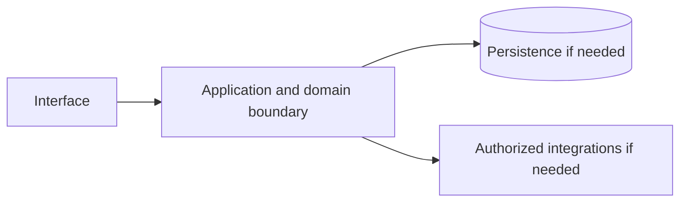

# Google Cloud — implementation skill (`google-cloud`)

> **Research status:** researched. Alternative coverage is **partial alternative coverage**; this describes candidate research only and does not determine whether your agent can build the product. Dossier prose, capability labels and source URLs are not automatically verified. The compiler does not fetch websites or candidate source and does not infer undocumented behavior.

> This is the coding-agent build skill for **Google Cloud**. Give this file to your coding agent in the project where you want the product built.

## Product description

This is the coding-agent skill for **Google Cloud** (`google-cloud`). Product status and capability notes below distinguish catalog leads from verified behavior; use the source index and current dossier before scoping implementation.

**Same file, three ways to get it:** download or copy `catalog/skills/google/google-cloud.md` from the catalog page, or run `npx rea-faang google-cloud --out ./google-cloud.md`, `npx rea-faang skills generate google-cloud` or `npx rea-faang build agent-kit google-cloud --out ./google-cloud-agent`. All produce this exact Markdown from the same compiler; no hand-edited variant exists.

## Operating procedure — from authorized observation to a working implementation

This skill is an execution brief, not a description. You are the consuming agent: you run it in the user’s own project and deliver an independent implementation there. Do not add the product to the REA FAANG catalog, do not edit the catalog repository, and do not ship the product inside it.

Workflow: **inputs → authorized REA → evidence → capabilities/workflows/states/limits/unknowns → foundation decision → plan → build in the consumer project → verify and report.** Every step produces an artifact; a later step may not silently fill a gap left by an earlier one.

### Inputs you must confirm before acting

| Input | Value for this product | Source of truth |
|---|---|---|
| Product identity | Google Cloud / `google-cloud` | `catalog/products.jsonl` |
| Official product URL | [https://cloud.google.com/](https://cloud.google.com/) | Catalog record; re-check it resolves and is first-party |
| Official documentation | [https://cloud.google.com/docs](https://cloud.google.com/docs) | Catalog record |
| Research dossier | `npx rea-faang research dossier google-cloud` | `research/companies/google/products/google-cloud.md` |
| REA report | `catalog/rea/google/google-cloud.md` (captured 2026-11-03T01:37:30.924Z, status captured) | Catalog evidence |
| REA raw evidence | `catalog/rea/evidence/google-cloud.json` (`ev_3ee055d5d47a7b5ac5570f928b1ed3445cca52a178112442039f442e8848474c`) | Catalog evidence |
| Alternative candidates | 4 candidate(s) recorded in section 9 | Curated landscape |
| User scope | Requested product area, platforms, users and non-goals | The user; ask when the answer changes the deliverable |
| Consumer project | Absolute path, stack, conventions, test commands, deployment target | The user’s repository, read before writing |
| Authorization | Public surfaces and the user’s own project only | Clean-room boundary in section 14 |

### Step 1 — confirm identity and authorization

Run `npx rea-faang products show google-cloud --format json` and `npx rea-faang research dossier google-cloud` and reconcile them with the user’s request. Confirm the product identity, the exact surface under analysis, the user’s authorization for that surface and the exclusion list. If authorization or identity is unclear, stop and ask; do not substitute inference.

### Step 2 — run the Reverse Engineer Anything framework

REA lives at <https://github.com/morluto/rea>. Use the framework’s own routing: browser surface → browser-scenario capture; supplied JavaScript/Electron/ASAR package → package analysis; native/mobile/firmware artifact → inventory then focused inspection; complete source repository with no shipped artifact question → ordinary repository analysis instead of REA.

**Tools that actually exist** (do not assume any of them are installed, and do not invent command names):

- **REA MCP tools**, when registered in your client: use the registered tool that matches the route above. List the available tools first; the catalog does not rename or wrap them.
- **REA CLI fallback**, only for an authorized local JavaScript tree or ASAR: `npx -y rea-agents@latest analyze-javascript-application /absolute/path/to/app --json`.
- **Browser surface, as recorded for this product:** provider `rea-playwright-browser-scenario v1`, target [https://cloud.google.com/](https://cloud.google.com/), captured 2026-11-03T01:37:30.924Z, evidence `ev_3ee055d5d47a7b5ac5570f928b1ed3445cca52a178112442039f442e8848474c`. Reproduce it with the REA browser-scenario tool when registered; if the capability is unavailable, record the capture as blocked instead of substituting screenshots or guesses.
- If a required capability is unavailable, record the blocker and continue with supported evidence. Never install unrelated engines merely because a tool is missing.

**Recorded for every action:** target URL/artifact and version or commit, tool and version, start state, exact actions, timestamps, evidence IDs, and what was observed versus inferred. Never bypass authentication, access controls, rate limits or licensing; never decompile protected binaries or redistribute protected assets.

### Step 3 — write the evidence ledger

One row per claim in `FINDINGS.md`, using the classifications in section 14: `VERIFIED` (observed or documented within the exact scope), `CORROBORATED` (multiple compatible sources), `INFERRED` (reasoned, not established), `PROPOSED` (independent design or candidate), `UNKNOWN`, `CONFLICTED`. A URL is not evidence; a claim needs a location in the source, an access date and its scope limit.

### Step 4 — extract capabilities, workflows, states, limits and unknowns

Map findings onto the capability leads and feature IDs in sections 2, 3 and 5, and record, for each: actor and permissions, entry point, inputs/outputs, preconditions, intermediate and persisted state, integrations, success, cancellation, failure and recovery, platform/version limits, and the unknowns that remain. Unchanged from the catalog: `GOOGLE-CLOUD-CAP-937F9FD3`, `GOOGLE-CLOUD-CAP-877368FA`, `GOOGLE-CLOUD-CAP-12837C5B`, `GOOGLE-CLOUD-CAP-0470C9D1`.

### Step 5 — decide the open-source foundation (mandatory gate)

Do not start building until section 9 records an explicit verdict: **REUSE**, **INTEGRATE**, **EXTEND**, **BUILD** or **INVESTIGATE MORE**. The verdict names the candidate (or none) and the evidence behind it. A curated candidate is a lead, never an approved foundation.

### Step 6 — turn findings into a plan

`PLAN.md` must carry: the agreed scope and non-goals; requirement IDs with their evidence/confidence; the foundation verdict and its obligations; architecture and data model labelled PROPOSED where they are your design; API/protocol contracts with authorization, errors, limits and idempotency; the test plan per requirement; and the explicit exclusion/unknown list. Anything still UNKNOWN stays blocked rather than guessed.

### Step 7 — build in the consumer project

Implement in the user’s repository with its stack, conventions and tests. Write original code and assets; do not copy proprietary source, protected assets, branding, copy text or assets you are not licensed to use. Match observable behavior and user-facing outcomes within the agreed scope — a functional equivalent, not a replica, and never a parity claim.

### Step 8 — verify and report

Run the project’s real checks and capture exit codes. Exercise the primary workflow plus the relevant failure, permission, cancellation and recovery paths through the interface the user will use. Report requirement → code → test evidence, everything partial, excluded or unknown, and every check not run. Do not weaken, skip or delete a failing check to make a result look green.

### Outputs expected

| Output | Where | Required content |
|---|---|---|
| Evidence ledger | `FINDINGS.md` in the consumer project | One row per claim: evidence ID, scope, action, classification, source location, access date, limitation |
| Capability and workflow map | `FINDINGS.md` | Evidenced capabilities, complete/partial workflows, states, permissions, failures and unknowns |
| Foundation decision record | `DECISION.md` in the consumer project | Candidate audit, coverage comparison and one explicit verdict from section 9 |
| Implementation plan | `PLAN.md` in the consumer project | Scope, requirement IDs, chosen foundation, architecture, proposed contracts, test plan, exclusions |
| Implementation | The consumer project’s own source tree | Original code and assets in the project’s conventions; no copied proprietary source |
| Tests | The consumer project’s test suite | Deterministic tests per implemented requirement plus relevant failure and permission paths |
| Report | `REPORT.md` in the consumer project | Requirement → code → test evidence, commands with real exit codes, partial/excluded/unknown items, checks not run |

### Stop conditions

- Authorization, target identity or user scope is unclear → stop and ask.
- A capability, contract or data structure is still UNKNOWN → keep it blocked; do not infer it from category, marketing or competitor behavior.
- No foundation verdict is recorded → return to section 9; do not begin implementation.
- A required tool or surface is unavailable → record the blocker and report the reduced scope.

## 1. Product identity and scope

| Field | Canonical record / result | Evidence status and limits |
|---|---|---|
| Name / stable ID | **Google Cloud** / `google-cloud` | Product catalog |
| Company / category | Google / `cloud_infrastructure` / `cloud_infrastructure`, `platform` | Product catalog |
| Official website / docs | [https://cloud.google.com/](https://cloud.google.com/) / [https://cloud.google.com/docs](https://cloud.google.com/docs) | URL lead; compiler does not fetch source |
| Lifecycle / supported versions / platforms | active / Unknown / Unknown | Version/platform matrix not structured |
| Intended users, roles, jobs, value | Unknown | No structured evidence |
| Boundaries / original architecture | Unknown | Do not infer from category or marketing |
| Independent implementation scope | User-selected; start with evidenced vertical slice | Proposed decision |
| Exclusions | Proprietary source, protected assets, unauthorized access, unsupported parity claims | Clean-room boundary; further product-specific limits unknown |

Research lens: **cloud_infrastructure** — verify real users/jobs, complete lifecycles, platform/version support, permissions, persistence, failure and recovery behavior. Product type is a question prompt, not evidence of features.

## 2. Product capability map

Capability labels are leads, not complete verified behavior.

| Feature ID | Capability lead | Verification | Evidence | Behavioral details / priority |
|---|---|---|---|---|
| `GOOGLE-CLOUD-CAP-937F9FD3` | Google Cloud is verified as a broad platform with compute, storage, data, AI, networking and developer service families. | VERIFIED | `ev-google-cloud-identity`, `ev-google-cloud-overview` | User problem, entry, I/O, preconditions, permissions, state/dependencies, failures/recovery, platform and priority are unknown; investigate. |
| `GOOGLE-CLOUD-CAP-877368FA` | The platform supports composing services into workload infrastructure; exact service behavior remains product-specific. | VERIFIED | `ev-google-cloud-overview` | User problem, entry, I/O, preconditions, permissions, state/dependencies, failures/recovery, platform and priority are unknown; investigate. |
| `GOOGLE-CLOUD-CAP-12837C5B` | The gcloud CLI and documented authentication provide an integration surface; permissions and project access are required. | VERIFIED | `ev-google-cloud-auth` | User problem, entry, I/O, preconditions, permissions, state/dependencies, failures/recovery, platform and priority are unknown; investigate. |
| `GOOGLE-CLOUD-CAP-0470C9D1` | Platform identity and access model are verified, but pricing, quotas, regions, compliance and project behavior were not exhaustively verified. | VERIFIED | `ev-google-cloud-identity`, `ev-google-cloud-auth` | User problem, entry, I/O, preconditions, permissions, state/dependencies, failures/recovery, platform and priority are unknown; investigate. |

## 3. Complete user workflows

**Observed start page, not a completed workflow:** dated capture exposes `button: Previous`, `button: Next`, `button: AI and machine learning keyboard_arrow_down`, `button: Compute keyboard_arrow_down`, `button: Storage keyboard_arrow_down`, `button: Databases keyboard_arrow_down`, `button: Data analytics keyboard_arrow_down`, `button: Networking keyboard_arrow_down`, `button: Developer tools keyboard_arrow_down`, `button: Security keyboard_arrow_down`, `button: Previous slide`, `button: Next slide`, `button: Pause animation`, `button: Ask Google Cloud`, `button: Search`, `link: Get started for free`, `link: Contact sales`, `link: Security Outpace adversaries in the AI era with Google AI Threat Defense Agentic Defense graphic`, `link: AI Announcements What Google Cloud announced in AI this month AI generated image`, `link: AI Infrastructure What’s new in AI infrastructure and orchestration this month AI Hypercomputer graphic`, `link: Customer Stories Learn how the world's leading innovators build with Gemini Illuminated modern glass enterprise campus atrium at dusk`, `link: AI generated colored squares Events Register to learn about the future of AI infrastructure on November 9th`, `link: developer tools Developer tools Introducing the developer plugin for AI coding agents`, `link: See all 150+ products`, `link: Gemini platform`, `link: View more AI products`, `link: Agent evals in 4 steps , 26 minutes 08 seconds`, `link: Gemini Enterprise icon Securely share AI agents with your organization Try Gemini Enterprise Plus edition`, `link: icon Get 35 learning credits at no cost on Google Skills with GEAR Join GEAR`, `link: icon Access free offers for common AI use cases View 10 free AI tools`, `link: Target and Google Cloud Target modernized their data infrastructure using Google Cloud to improve advertising performance. Watch video`, `link: Home Depot The Home Depot turns fragmented customer service into seamless journeys with Google Cloud Watch video`, `link: VW logo Volkswagen uses Gemini to power its virtual assistant in the myVW app, surfacing helpful information from the owner’s manual Watch video`, `link: Gemini`, `link: product discovery`, `link: bank fraud`, `link: Request a demo`, `link: See all industries`, `link: best buy boxes 9 / top 10 retail companies trust Google Cloud Bestbuy Best Buy uses Google Cloud generative AI to power its virtual assistants, freeing up their customer care agents to troubleshoot product issues, change order delivery and schedules, and manage subscriptions. Discover what you can do with our retail solutions. Explore retail solutions`, `link: See more customers`, `link: Google Cloud`, `link: Overview`, `link: Solutions`, `link: Products`, `link: Pricing`, `link: Resources`, `combobox: Search`, `link: Docs`, `link: Support`, `link: Sign in`, `link: Choosing Google Cloud`, `link: Trust and security`, `link: Modern Infrastructure Cloud`, `link: Multicloud`, `link: Global infrastructure`, `link: Locations`, `link: Customers and case studies`, `link: Analyst reports`, `link: Whitepapers`, `link: Blog`, `link: Google Cloud pricing`, `link: Google Workspace pricing`, `link: See all products`, `link: Infrastructure modernization`, `link: Databases`, `link: Application modernization`, `link: Smart analytics`, `link: Artificial Intelligence`, `link: Security`, `link: Productivity & work transformation`, `link: Industry solutions`, `link: DevOps solutions`, `link: Small business solutions`, `link: See all solutions`, `link: Google Cloud Affiliate Program`, `link: Google Cloud documentation`, `link: Google Cloud quickstarts`, `link: Google Cloud Marketplace`, `link: Learn about cloud computing`, `link: Code samples`, `link: Cloud Architecture Center`, `link: Training`, `link: Builders Hub`, `link: Certifications`, `link: Google for Developers`, `link: Google Cloud for Startups`, `link: System status`, `link: Release Notes`, `link: Find a Partner`, `link: Become a Partner`, `link: Events`, `link: Podcasts`, `link: Developer Center`, `link: Press Corner`, `link: Google Cloud on YouTube`, `link: Google Cloud Tech on YouTube`, `link: Follow on X`, `link: Join User Research`, `link: We're hiring. Join Google Cloud!`, `link: Community forums`, `link: About Google`, `link: Privacy`, `link: Site terms`, `link: Google Cloud terms`, `link: Subscribe`, `combobox: Language Selector`. It did not activate controls; submissions, results, validation, persistence, cancellation, retry and recovery remain UNKNOWN.

- **Google Cloud is verified as a broad platform with compute, storage, data, AI, networking and developer service families.:** full workflow is UNKNOWN; investigate actor/permissions, start state, actions/responses, validation, intermediate state, persistence, integrations, success, cancellation, errors, retry, recovery and edge cases. Do not invent a category-typical journey.
- **The platform supports composing services into workload infrastructure; exact service behavior remains product-specific.:** full workflow is UNKNOWN; investigate actor/permissions, start state, actions/responses, validation, intermediate state, persistence, integrations, success, cancellation, errors, retry, recovery and edge cases. Do not invent a category-typical journey.
- **The gcloud CLI and documented authentication provide an integration surface; permissions and project access are required.:** full workflow is UNKNOWN; investigate actor/permissions, start state, actions/responses, validation, intermediate state, persistence, integrations, success, cancellation, errors, retry, recovery and edge cases. Do not invent a category-typical journey.
- **Platform identity and access model are verified, but pricing, quotas, regions, compliance and project behavior were not exhaustively verified.:** full workflow is UNKNOWN; investigate actor/permissions, start state, actions/responses, validation, intermediate state, persistence, integrations, success, cancellation, errors, retry, recovery and edge cases. Do not invent a category-typical journey.

## 4. Interaction and interface specification

| Observable interface | Evidence-backed snapshot | Unknown / untested |
|---|---|---|
| Navigation/landmarks | `banner`, `navigation`, `contentinfo`, `navigation: Footer Links`, `navigation: Utility links` | Full IA/routes/authenticated navigation |
| Views/headings | `The new way to cloud`, `Developers`, `Business leaders`, `Special programs`, `Build with the cloud platform designed for developers and AI`, `AI and machine learning`, `Compute`, `Storage`, `Databases`, `Data analytics`, `Networking`, `Developer tools`, `Security`, `Build and scale generative AI apps and agents with Gemini platform`, `AI innovation happens on Google Cloud`, `Solve your business problems with our industry solutions`, `Let’s start building your tomorrow, today`, `Why Google`, `Products and pricing`, `Solutions`, `Resources`, `Engage` | Results and subsequent views |
| Controls | `button: Previous`, `button: Next`, `button: AI and machine learning keyboard_arrow_down`, `button: Compute keyboard_arrow_down`, `button: Storage keyboard_arrow_down`, `button: Databases keyboard_arrow_down`, `button: Data analytics keyboard_arrow_down`, `button: Networking keyboard_arrow_down`, `button: Developer tools keyboard_arrow_down`, `button: Security keyboard_arrow_down`, `button: Previous slide`, `button: Next slide`, `button: Pause animation`, `button: Ask Google Cloud`, `button: Search`, `link: Get started for free`, `link: Contact sales`, `link: Security Outpace adversaries in the AI era with Google AI Threat Defense Agentic Defense graphic`, `link: AI Announcements What Google Cloud announced in AI this month AI generated image`, `link: AI Infrastructure What’s new in AI infrastructure and orchestration this month AI Hypercomputer graphic`, `link: Customer Stories Learn how the world's leading innovators build with Gemini Illuminated modern glass enterprise campus atrium at dusk`, `link: AI generated colored squares Events Register to learn about the future of AI infrastructure on November 9th`, `link: developer tools Developer tools Introducing the developer plugin for AI coding agents`, `link: See all 150+ products`, `link: Gemini platform`, `link: View more AI products`, `link: Agent evals in 4 steps , 26 minutes 08 seconds`, `link: Gemini Enterprise icon Securely share AI agents with your organization Try Gemini Enterprise Plus edition`, `link: icon Get 35 learning credits at no cost on Google Skills with GEAR Join GEAR`, `link: icon Access free offers for common AI use cases View 10 free AI tools`, `link: Target and Google Cloud Target modernized their data infrastructure using Google Cloud to improve advertising performance. Watch video`, `link: Home Depot The Home Depot turns fragmented customer service into seamless journeys with Google Cloud Watch video`, `link: VW logo Volkswagen uses Gemini to power its virtual assistant in the myVW app, surfacing helpful information from the owner’s manual Watch video`, `link: Gemini`, `link: product discovery`, `link: bank fraud`, `link: Request a demo`, `link: See all industries`, `link: best buy boxes 9 / top 10 retail companies trust Google Cloud Bestbuy Best Buy uses Google Cloud generative AI to power its virtual assistants, freeing up their customer care agents to troubleshoot product issues, change order delivery and schedules, and manage subscriptions. Discover what you can do with our retail solutions. Explore retail solutions`, `link: See more customers`, `link: Google Cloud`, `link: Overview`, `link: Solutions`, `link: Products`, `link: Pricing`, `link: Resources`, `combobox: Search`, `link: Docs`, `link: Support`, `link: Sign in`, `link: Choosing Google Cloud`, `link: Trust and security`, `link: Modern Infrastructure Cloud`, `link: Multicloud`, `link: Global infrastructure`, `link: Locations`, `link: Customers and case studies`, `link: Analyst reports`, `link: Whitepapers`, `link: Blog`, `link: Google Cloud pricing`, `link: Google Workspace pricing`, `link: See all products`, `link: Infrastructure modernization`, `link: Databases`, `link: Application modernization`, `link: Smart analytics`, `link: Artificial Intelligence`, `link: Security`, `link: Productivity & work transformation`, `link: Industry solutions`, `link: DevOps solutions`, `link: Small business solutions`, `link: See all solutions`, `link: Google Cloud Affiliate Program`, `link: Google Cloud documentation`, `link: Google Cloud quickstarts`, `link: Google Cloud Marketplace`, `link: Learn about cloud computing`, `link: Code samples`, `link: Cloud Architecture Center`, `link: Training`, `link: Builders Hub`, `link: Certifications`, `link: Google for Developers`, `link: Google Cloud for Startups`, `link: System status`, `link: Release Notes`, `link: Find a Partner`, `link: Become a Partner`, `link: Events`, `link: Podcasts`, `link: Developer Center`, `link: Press Corner`, `link: Google Cloud on YouTube`, `link: Google Cloud Tech on YouTube`, `link: Follow on X`, `link: Join User Research`, `link: We're hiring. Join Google Cloud!`, `link: Community forums`, `link: About Google`, `link: Privacy`, `link: Site terms`, `link: Google Cloud terms`, `link: Subscribe`, `combobox: Language Selector` | Activation, forms, validation, loading/empty/success/error, keyboard behavior |
| Links | `[Get started for free](https://console.cloud.google.com/freetrial)`, `[Contact sales](https://cloud.google.com/contact)`, `[Security Outpace adversaries in the AI era with Google AI Threat Defense Agentic Defense graphic](https://cloud.google.com/security/ai-threat-defense)`, `[AI Announcements What Google Cloud announced in AI this month AI generated image](https://cloud.google.com/blog/products/ai-machine-learning/what-google-cloud-announced-in-ai-this-month)`, `[AI Infrastructure What’s new in AI infrastructure and orchestration this month AI Hypercomputer graphic](https://cloud.google.com/blog/topics/ai-infrastructure/whats-new-in-ai-infrastructure-this-month)`, `[Customer Stories Learn how the world's leading innovators build with Gemini Illuminated modern glass enterprise campus atrium at dusk](https://cloud.google.com/customers)`, `[AI generated colored squares Events Register to learn about the future of AI infrastructure on November 9th](https://cloudonair.withgoogle.com/events/the-future-of-ai-infrastructure?utm_source=cgc-site&utm_medium=et&utm_campaign=FY26-Q4-GLOBAL-STO885-onlineevent-er-aiinfrafutr-255935&utm_content=webinar_invite_cgc_home_page_tile&utm_term=-sprint2)`, `[developer tools Developer tools Introducing the developer plugin for AI coding agents](https://cloud.google.com/blog/topics/developers-practitioners/introducing-the-google-cloud-developer-plugin-for-ai-coding-agents)`, `[See all 150+ products](https://cloud.google.com/products)`, `[Gemini platform](https://cloud.google.com/products/gemini-enterprise-agent-platform)`, `[Get started for free](https://console.cloud.google.com/freetrial/?redirectPath=/agent-platform/overview)`, `[View more AI products](https://cloud.google.com/products/ai)`, `[Agent evals in 4 steps , 26 minutes 08 seconds](https://www.youtube.com/watch?v=e8hehBcYU7E)`, `[Gemini Enterprise icon Securely share AI agents with your organization Try Gemini Enterprise Plus edition](https://console.cloud.google.com/freetrial?redirectPath=/gemini-enterprise)`, `[icon Get 35 learning credits at no cost on Google Skills with GEAR Join GEAR](https://developers.google.com/program/gear/?utm_source=web&utm_medium=cgc&utm_campaign=FY26-Q2-GLOBAL-GOO38926-onlineevent-er-gear-135947-web-AgentPlatform-cgchomepage&utm_content=Next26&utm_term=-)`, `[icon Access free offers for common AI use cases View 10 free AI tools](https://cloud.google.com/use-cases/free-ai-tools)`, `[Target and Google Cloud Target modernized their data infrastructure using Google Cloud to improve advertising performance. Watch video](https://www.youtube.com/watch?v=LmL-U4HSLg0)`, `[Home Depot The Home Depot turns fragmented customer service into seamless journeys with Google Cloud Watch video](https://www.youtube.com/watch?v=c8t_KZeqfVw)`, `[VW logo Volkswagen uses Gemini to power its virtual assistant in the myVW app, surfacing helpful information from the owner’s manual Watch video](https://www.youtube.com/watch?v=zIzgRazXdUk&)`, `[Gemini](https://cloud.google.com/generative-ai-studio)`, `[product discovery](https://cloud.google.com/solutions/retail-product-discovery)`, `[bank fraud](https://cloud.google.com/solutions/financial-services)`, `[Request a demo](https://cloud.google.com/contact?direct=true)`, `[See all industries](https://cloud.google.com/solutions#section-2)`, `[best buy boxes 9 / top 10 retail companies trust Google Cloud Bestbuy Best Buy uses Google Cloud generative AI to power its virtual assistants, freeing up their customer care agents to troubleshoot product issues, change order delivery and schedules, and manage subscriptions. Discover what you can do with our retail solutions. Explore retail solutions](https://cloud.google.com/solutions/retail)`, `[See more customers](https://cloud.google.com/customers)`, `[Google Cloud](https://cloud.google.com/)`, `[Overview](https://cloud.google.com/why-google-cloud)`, `[Solutions](https://cloud.google.com/solutions)`, `[Products](https://cloud.google.com/products)`, `[Pricing](https://cloud.google.com/pricing)`, `[Resources](https://cloud.google.com/docs/get-started)`, `[Docs](https://cloud.google.com/docs)`, `[Support](https://cloud.google.com/support-hub)`, `[Sign in](https://accounts.google.com/AccountChooser?continue=https://cloud.google.com/&hl=en-US&prompt=select_account&service=cloudconsole)`, `[Choosing Google Cloud](https://cloud.google.com/why-google-cloud)`, `[Trust and security](https://cloud.google.com/trust-center)`, `[Modern Infrastructure Cloud](https://cloud.google.com/solutions/modern-infrastructure)`, `[Multicloud](https://cloud.google.com/multicloud)`, `[Global infrastructure](https://cloud.google.com/infrastructure)` | Deep-link and route semantics |
| Responsive/platform behavior | Unknown | No comparison captured |
| Search/filter/sort/settings/import/export | Unknown unless explicitly observed | Complete interactions not captured |

A REA page capture is not product-wide interface evidence. Use original interface design and assets; do not reproduce protected branding.

## 5. Functional requirements and traceability

### REQ-FUNC-937F9FD3 — Google Cloud is verified as a broad platform with compute, storage, data, AI, networking and developer service families.
- **Required behavior:** Unknown; capability is a research lead until observed/documented.
- **Preconditions, expected result, failures:** Unknown; derive from researched workflow including permission and recovery paths.
- **Priority:** Unassigned; rank after user scope/impact are known.
- **Evidence / verification:** VERIFIED; `ev-google-cloud-identity`, `ev-google-cloud-overview`.
- **Acceptance criteria:** Blocked until a repeatable input, observable outcome and relevant negative/error case have an evidence-backed oracle.
- **Associated test ID:** `TEST-FUNC-937F9FD3`; fixture and expected output must be specified from evidence.
- **Trace:** `GOOGLE-CLOUD-CAP-937F9FD3` → `REQ-FUNC-937F9FD3` → `TEST-FUNC-937F9FD3`.

### REQ-FUNC-877368FA — The platform supports composing services into workload infrastructure; exact service behavior remains product-specific.
- **Required behavior:** Unknown; capability is a research lead until observed/documented.
- **Preconditions, expected result, failures:** Unknown; derive from researched workflow including permission and recovery paths.
- **Priority:** Unassigned; rank after user scope/impact are known.
- **Evidence / verification:** VERIFIED; `ev-google-cloud-overview`.
- **Acceptance criteria:** Blocked until a repeatable input, observable outcome and relevant negative/error case have an evidence-backed oracle.
- **Associated test ID:** `TEST-FUNC-877368FA`; fixture and expected output must be specified from evidence.
- **Trace:** `GOOGLE-CLOUD-CAP-877368FA` → `REQ-FUNC-877368FA` → `TEST-FUNC-877368FA`.

### REQ-FUNC-12837C5B — The gcloud CLI and documented authentication provide an integration surface; permissions and project access are required.
- **Required behavior:** Unknown; capability is a research lead until observed/documented.
- **Preconditions, expected result, failures:** Unknown; derive from researched workflow including permission and recovery paths.
- **Priority:** Unassigned; rank after user scope/impact are known.
- **Evidence / verification:** VERIFIED; `ev-google-cloud-auth`.
- **Acceptance criteria:** Blocked until a repeatable input, observable outcome and relevant negative/error case have an evidence-backed oracle.
- **Associated test ID:** `TEST-FUNC-12837C5B`; fixture and expected output must be specified from evidence.
- **Trace:** `GOOGLE-CLOUD-CAP-12837C5B` → `REQ-FUNC-12837C5B` → `TEST-FUNC-12837C5B`.

### REQ-FUNC-0470C9D1 — Platform identity and access model are verified, but pricing, quotas, regions, compliance and project behavior were not exhaustively verified.
- **Required behavior:** Unknown; capability is a research lead until observed/documented.
- **Preconditions, expected result, failures:** Unknown; derive from researched workflow including permission and recovery paths.
- **Priority:** Unassigned; rank after user scope/impact are known.
- **Evidence / verification:** VERIFIED; `ev-google-cloud-identity`, `ev-google-cloud-auth`.
- **Acceptance criteria:** Blocked until a repeatable input, observable outcome and relevant negative/error case have an evidence-backed oracle.
- **Associated test ID:** `TEST-FUNC-0470C9D1`; fixture and expected output must be specified from evidence.
- **Trace:** `GOOGLE-CLOUD-CAP-0470C9D1` → `REQ-FUNC-0470C9D1` → `TEST-FUNC-0470C9D1`.

Keep original behavior VERIFIED/CORROBORATED distinct from inference and independent decisions INFERRED/PROPOSED. UNKNOWN stays unknown; contradictory evidence stays CONFLICTED. These requirements are blocked planning placeholders until evidence, user scope, measurable criteria and test oracles are recorded.

## 6. Data model and state

**Original product structures:** UNKNOWN. No structured evidence establishes fields/types, IDs, ownership/permissions, lifecycle, persistence, constraints, deletion/retention, import/export, migration, concurrency or indexes.

**Independent model (PROPOSED):** define only state needed for the researched first slice; specify IDs, validation, owners, state transitions, concurrency, deletion/export/retention and migration. Do not describe it as the target’s model.

## 7. APIs, integrations and protocols

**Original contracts:** none verified in structured evidence. Dossier prose does not establish supported APIs. Do not invent target endpoints, schemas, auth, events or limits. If the independent implementation needs an interface, define a versioned contract labelled PROPOSED, including request/response, authorization, errors, limits, timeouts, retries and idempotency.

## 8. Architecture and technical design

**PROPOSED independent design; target internals unknown.** Use only components required by verified scope.

```mermaid
flowchart LR
  UI[Interface] --> APP[Application and domain boundary]
  APP --> DB[(Persistence if needed)]
  APP --> EXT[Authorized integrations if needed]
```

Separate interface/domain/persistence/integration boundaries. Enforce access at trusted boundaries, isolate tenants where relevant, and define timeout/partial failure behavior. Add queues/caches/scaling/deployment components only when requirements justify them. Record configuration, secrets, data flow, recovery, observability and deployment assumptions in the implementation project.

## 9. Open-source foundation and dependency strategy

**Mandatory decision gate.** Identify real candidates, compare them against the findings from section 14, and record one explicit verdict before any implementation work. A curated candidate is a research lead; nothing here has been cloned, executed, license-audited or security-reviewed by the catalog compiler.

### 9.1 Candidate register

| Candidate | Repository | License | Claimed coverage (unverified) | Limitations | Maintenance | Compatibility | Verdict |
|---|---|---|---|---|---|---|---|
| [OpenStack](https://www.openstack.org/) | Not recorded; verify the canonical repository | Apache-2.0 (unverified) | Private-cloud IaaS (compute, storage, network). | The main open IaaS. | Not recorded — verify last release, commit activity and open issues | Not recorded — verify language, runtime, deployment and integration surface | **INVESTIGATE MORE** |
| [Apache CloudStack](https://cloudstack.apache.org/) | Not recorded; verify the canonical repository | Apache-2.0 (unverified) | Turnkey IaaS platform. | Simpler single-stack option. | Not recorded — verify last release, commit activity and open issues | Not recorded — verify language, runtime, deployment and integration surface | **INVESTIGATE MORE** |
| [OpenNebula](https://opennebula.io/) | Not recorded; verify the canonical repository | Apache-2.0 (unverified) | Private-cloud management. | Lightweight alternative. | Not recorded — verify last release, commit activity and open issues | Not recorded — verify language, runtime, deployment and integration surface | **INVESTIGATE MORE** |
| [Kubernetes](https://kubernetes.io/) | [repository](https://github.com/kubernetes/kubernetes) | Apache-2.0 (unverified) | Container platform layer of a modern private cloud. | Layer, not a full cloud. | Not recorded — verify last release, commit activity and open issues | Not recorded — verify language, runtime, deployment and integration surface | **INVESTIGATE MORE** |

Repository, license, maintenance and compatibility are catalog claims until you check them. Re-verify each against the exact version you would adopt; a README, a star count or this table is not proof.

### 9.2 Comparison against the REA findings

Map every capability lead and requirement from sections 2 and 5 to what the candidate actually implements, and say what evidence supports the mapping. Where the catalog has no verified behavior, the comparison is a research task, not a conclusion:

| Requirement / capability lead | Candidate coverage | Evidence for the claim | Gap that remains |
|---|---|---|---|
| `GOOGLE-CLOUD-CAP-937F9FD3` — Google Cloud is verified as a broad platform with compute, storage, data, AI, networking and developer service families. | Not verified against OpenStack | None yet; compare with `ev_3ee055d5d47a7b5ac5570f928b1ed3445cca52a178112442039f442e8848474c` | Candidate code path and tests must be inspected |
| `GOOGLE-CLOUD-CAP-877368FA` — The platform supports composing services into workload infrastructure; exact service behavior remains product-specific. | Not verified against OpenStack | None yet; compare with `ev_3ee055d5d47a7b5ac5570f928b1ed3445cca52a178112442039f442e8848474c` | Candidate code path and tests must be inspected |
| `GOOGLE-CLOUD-CAP-12837C5B` — The gcloud CLI and documented authentication provide an integration surface; permissions and project access are required. | Not verified against OpenStack | None yet; compare with `ev_3ee055d5d47a7b5ac5570f928b1ed3445cca52a178112442039f442e8848474c` | Candidate code path and tests must be inspected |
| `GOOGLE-CLOUD-CAP-0470C9D1` — Platform identity and access model are verified, but pricing, quotas, regions, compliance and project behavior were not exhaustively verified. | Not verified against OpenStack | None yet; compare with `ev_3ee055d5d47a7b5ac5570f928b1ed3445cca52a178112442039f442e8848474c` | Candidate code path and tests must be inspected |

### 9.3 Decision

**Current verdict: INVESTIGATE MORE** — the first candidate to audit is **OpenStack** (Private-cloud IaaS (compute, storage, network).), and no candidate has been verified yet.

Provisional routing for this product, to be confirmed by that audit:

- If **OpenStack** implements the core capability leads with a compatible license and maintainable code → **REUSE** it as the foundation.
- If it covers only part of the scope, or would need to run beside the user’s existing system → **INTEGRATE** it behind a defined boundary, or **EXTEND** it with original modules where its extension points allow it.
- If no candidate survives inspection → **BUILD** an independent implementation, and record which candidates failed and why.
- If the evidence is still insufficient → **INVESTIGATE MORE**, naming the exact question, source and check that would settle it.

### 9.4 What each verdict obliges

| Verdict | You must have | It commits you to |
|---|---|---|
| **REUSE** | The candidate implements the in-scope capability leads; license and dependencies checked against the user’s distribution model; version pinned; tests/CI reviewed | Adopt it as the foundation, keep its license notices, and document the upstream version and update path |
| **INTEGRATE** | A verified boundary: API/protocol, data ownership, failure and upgrade behavior, plus a license review of both sides | Run the candidate beside the user’s system through an explicit contract; test the boundary and its failure modes |
| **EXTEND** | Documented extension points, an upstream contribution or fork policy, and a migration path for local changes | Add original modules on top of the candidate; record what is upstream versus local and how it survives updates |
| **BUILD** | The candidates that were searched, inspected and rejected, with reasons; the evidenced scope; a test plan | Build independently with original code and assets, reusing only libraries whose licenses permit it |
| **INVESTIGATE MORE** | The exact open question, the source or tool that answers it, and the date by which it must be answered | Do not implement the affected scope yet; resolve or explicitly block it first |

**No verified alternative is a valid outcome**: mark the coverage UNKNOWN / PENDING, say what you searched and what you inspected, and let the verdict be INVESTIGATE MORE or BUILD. Absence of evidence in this catalog is never evidence of absence.

## 10. Security and privacy

No product-specific security/privacy controls are verified by current evidence. Proposed independent controls: authenticate/authorize state changes server-side; validate inputs; protect secrets; apply least privilege and suitable abuse/rate controls; minimize data; define consent, retention, export/delete, backup/restore; keep sensitive payloads out of logs; handle external trust boundaries/timeouts/retries; test cross-user access, malformed inputs, leaks, abuse and recovery.

Product-specific review: Review product-specific identity, authorization, privacy, abuse and dependency threats. Do not claim compliance, privacy or security parity without scoped assessment.

## 11. Error handling and edge cases

These are test prompts, not target behavior assertions. Keep only relevant cases and derive expected behavior from evidence or label an independent decision PROPOSED.

- **EDGE-001:** Missing/malformed/oversized input. Target behavior is UNKNOWN until researched; specify recovery before release.
- **EDGE-002:** Unauthorized or revoked action and tenant isolation where applicable. Target behavior is UNKNOWN until researched; specify recovery before release.
- **EDGE-003:** Empty data/results and duplicate operations. Target behavior is UNKNOWN until researched; specify recovery before release.
- **EDGE-004:** Concurrent updates or stale writes to mutable state. Target behavior is UNKNOWN until researched; specify recovery before release.
- **EDGE-005:** Network timeout, throttling, external outage, retry and partial failure. Target behavior is UNKNOWN until researched; specify recovery before release.
- **EDGE-006:** Cancellation/interruption during state change and restart recovery. Target behavior is UNKNOWN until researched; specify recovery before release.
- **EDGE-007:** Corrupt/incompatible imported or persisted data; migration failure. Target behavior is UNKNOWN until researched; specify recovery before release.
- **EDGE-008:** Expired credentials/session where applicable. Target behavior is UNKNOWN until researched; specify recovery before release.

## 12. Testing and behavioral verification

- **TEST-FUNC-937F9FD3** → `REQ-FUNC-937F9FD3`: unit/integration/E2E level after interface selection. Setup: deterministic fixture for evidenced precondition. Steps: main workflow plus relevant error/permission branch. Expected result: unknown until evidence defines oracle. Pass: repeatable assertions meet approved criteria. No network in routine tests; no claim of original parity.
- **TEST-FUNC-877368FA** → `REQ-FUNC-877368FA`: unit/integration/E2E level after interface selection. Setup: deterministic fixture for evidenced precondition. Steps: main workflow plus relevant error/permission branch. Expected result: unknown until evidence defines oracle. Pass: repeatable assertions meet approved criteria. No network in routine tests; no claim of original parity.
- **TEST-FUNC-12837C5B** → `REQ-FUNC-12837C5B`: unit/integration/E2E level after interface selection. Setup: deterministic fixture for evidenced precondition. Steps: main workflow plus relevant error/permission branch. Expected result: unknown until evidence defines oracle. Pass: repeatable assertions meet approved criteria. No network in routine tests; no claim of original parity.
- **TEST-FUNC-0470C9D1** → `REQ-FUNC-0470C9D1`: unit/integration/E2E level after interface selection. Setup: deterministic fixture for evidenced precondition. Steps: main workflow plus relevant error/permission branch. Expected result: unknown until evidence defines oracle. Pass: repeatable assertions meet approved criteria. No network in routine tests; no claim of original parity.

These are proposed deterministic implementation-test plans, not original-product observations. Compare the original only through separately authorized, repeatable public observation. A passing spec test does not establish parity.

## 13. Implementation roadmap

### Phase 1 — Foundation and dependencies

- **Tasks:** Inspect user project, stack, constraints, tests, candidate implementations and licenses.
- **Prerequisites:** Repository inspection and user scope.
- **Deliverables:** Project map, evidence ledger, reuse decision, bounded plan
- **Requirements:** Select after evidence review
- **Tests:** Clean setup/validation smoke test
- **Completion:** Clean setup and documented dependency/reuse decision.
- **Unresolved risks:** Record source limitations, conflicts and unverified compatibility.

### Phase 2 — Core domain behavior

- **Tasks:** Research then implement one useful vertical slice with explicit state, validation and permissions.
- **Prerequisites:** Phase 1 and evidence/scope decisions
- **Deliverables:** Integrated working slice and updated traceability
- **Requirements:** REQ-FUNC-937F9FD3, REQ-FUNC-877368FA, REQ-FUNC-12837C5B, REQ-FUNC-0470C9D1
- **Tests:** Focused tests for implemented requirements and failures
- **Completion:** Integrated domain behavior with deterministic unit/integration tests.
- **Unresolved risks:** Record source limitations, conflicts and unverified compatibility.

### Phase 3 — Primary user workflows

- **Tasks:** Complete the best-evidenced journey through success, cancellation and recovery.
- **Prerequisites:** Phase 2 and evidence/scope decisions
- **Deliverables:** Integrated working slice and updated traceability
- **Requirements:** REQ-FUNC-937F9FD3, REQ-FUNC-877368FA, REQ-FUNC-12837C5B, REQ-FUNC-0470C9D1
- **Tests:** Focused tests for implemented requirements and failures
- **Completion:** E2E acceptance checks via user-facing interface.
- **Unresolved risks:** Record source limitations, conflicts and unverified compatibility.

### Phase 4 — Integrations

- **Tasks:** Add only documented/authorized integrations; mock boundaries for offline routine tests.
- **Prerequisites:** Phase 3 and evidence/scope decisions
- **Deliverables:** Integrated working slice and updated traceability
- **Requirements:** Select after evidence review
- **Tests:** Focused tests for implemented requirements and failures
- **Completion:** Contract and failure-injection tests.
- **Unresolved risks:** Record source limitations, conflicts and unverified compatibility.

### Phase 5 — Secondary capabilities

- **Tasks:** Implement remaining in-scope behavior by user priority and evidence.
- **Prerequisites:** Phase 4 and evidence/scope decisions
- **Deliverables:** Integrated working slice and updated traceability
- **Requirements:** Select after evidence review
- **Tests:** Focused tests for implemented requirements and failures
- **Completion:** Trace: REQ-FUNC-937F9FD3, REQ-FUNC-877368FA, REQ-FUNC-12837C5B, REQ-FUNC-0470C9D1; document exclusions and unknowns.
- **Unresolved risks:** Record source limitations, conflicts and unverified compatibility.

### Phase 6 — Security and reliability

- **Tasks:** Review access, privacy, abuse, migration, backup, observability and recovery as applicable.
- **Prerequisites:** Phase 5 and evidence/scope decisions
- **Deliverables:** Integrated working slice and updated traceability
- **Requirements:** Select after evidence review
- **Tests:** Focused tests for implemented requirements and failures
- **Completion:** Applicable security/recovery checks and risks recorded.
- **Unresolved risks:** Record source limitations, conflicts and unverified compatibility.

### Phase 7 — Verification and release

- **Tasks:** Run project checks; inspect behavior, accessibility, compatibility, license and docs.
- **Prerequisites:** Phase 6 and evidence/scope decisions
- **Deliverables:** Integrated working slice and updated traceability
- **Requirements:** Select after evidence review
- **Tests:** Focused tests for implemented requirements and failures
- **Completion:** Reproducible result and transparent completion/gap report.
- **Unresolved risks:** Record source limitations, conflicts and unverified compatibility.

## 14. Evidence, uncertainty and exclusions

### Evidence index

| Source ID | Title / location | URL | Access date | Claim supported | Classification and limits |
|---|---|---|---|---|---|
| `ev-google-cloud-identity` | Products and Services — The official catalogue lists more than one hundred Google Cloud products across compute, storage, AI/ML, databases, analytics, security and application development. | [link](https://cloud.google.com/products) | 2026-11-03T00:00:00Z | Google Cloud is an active public cloud platform with a broad catalogue of infrastructure, data, AI and developer services. | **VERIFIED** — Evidence status verified; inspect source and claim scope. |
| `ev-google-cloud-overview` | Google Cloud overview — The official overview describes selecting and combining Google Cloud services to build required infrastructure and workloads. | [link](https://docs.cloud.google.com/docs/overview) | 2026-11-03T00:00:00Z | Google Cloud services are combined into infrastructure for websites and applications. | **VERIFIED** — Evidence status verified; inspect source and claim scope. |
| `ev-google-cloud-auth` | Authenticate for the gcloud CLI — The official documentation describes user and application authentication for gcloud and Google Cloud APIs. | [link](https://docs.cloud.google.com/sdk/docs/authenticate) | 2026-11-03T00:00:00Z | The Google Cloud CLI must authenticate before accessing Google Cloud APIs and resources. | **VERIFIED** — Evidence status verified; inspect source and claim scope. |
| `SRC-PRODUCT` | Official product page — Catalog identity field; page not fetched by compiler. | [link](https://cloud.google.com/) | 2026-11-03T00:00:00Z | Google Cloud is identified at this URL in the canonical catalog. | **UNKNOWN** — Catalog URL is a lead, not independently checked behavior. |
| `SRC-DOCS` | Official documentation entry — No claim-level section recorded. | [link](https://cloud.google.com/docs) | 2026-11-03T00:00:00Z | Documentation entry-point URL is recorded. | **UNKNOWN** — Source is not fetched and URL alone establishes no behavior. |
| `SRC-OFFICIAL-1` | Additional official source lead — Claim/section not recorded. | [link](https://cloud.google.com/products) | Not recorded | Official source URL is listed in product record. | **UNKNOWN** — Source content is not fetched. |
| `SRC-OFFICIAL-2` | Additional official source lead — Claim/section not recorded. | [link](https://docs.cloud.google.com/docs/overview) | Not recorded | Official source URL is listed in product record. | **UNKNOWN** — Source content is not fetched. |
| `SRC-OFFICIAL-3` | Additional official source lead — Claim/section not recorded. | [link](https://docs.cloud.google.com/sdk/docs/authenticate) | Not recorded | Official source URL is listed in product record. | **UNKNOWN** — Source content is not fetched. |
| `ev_3ee055d5d47a7b5ac5570f928b1ed3445cca52a178112442039f442e8848474c` | Google Cloud Public web-surface observation (REA) — REA report; status captured; completeness reported complete. | [link](https://cloud.google.com/) | 2026-11-03T01:37:30.924Z | A dated unauthenticated snapshot exposed controls button: Previous, button: Next, button: AI and machine learning keyboard_arrow_down, button: Compute keyboard_arrow_down, button: Storage keyboard_arrow_down, button: Databases keyboard_arrow_down, button: Data analytics keyboard_arrow_down, button: Networking keyboard_arrow_down, button: Developer tools keyboard_arrow_down, button: Security keyboard_arrow_down, button: Previous slide, button: Next slide, button: Pause animation, button: Ask Google Cloud, button: Search, link: Get started for free, link: Contact sales, link: Security Outpace adversaries in the AI era with Google AI Threat Defense Agentic Defense graphic, link: AI Announcements What Google Cloud announced in AI this month AI generated image, link: AI Infrastructure What’s new in AI infrastructure and orchestration this month AI Hypercomputer graphic, link: Customer Stories Learn how the world's leading innovators build with Gemini Illuminated modern glass enterprise campus atrium at dusk, link: AI generated colored squares Events Register to learn about the future of AI infrastructure on November 9th, link: developer tools Developer tools Introducing the developer plugin for AI coding agents, link: See all 150+ products, link: Gemini platform, link: View more AI products, link: Agent evals in 4 steps , 26 minutes 08 seconds, link: Gemini Enterprise icon Securely share AI agents with your organization Try Gemini Enterprise Plus edition, link: icon Get 35 learning credits at no cost on Google Skills with GEAR Join GEAR, link: icon Access free offers for common AI use cases View 10 free AI tools, link: Target and Google Cloud Target modernized their data infrastructure using Google Cloud to improve advertising performance. Watch video, link: Home Depot The Home Depot turns fragmented customer service into seamless journeys with Google Cloud Watch video, link: VW logo Volkswagen uses Gemini to power its virtual assistant in the myVW app, surfacing helpful information from the owner’s manual Watch video, link: Gemini, link: product discovery, link: bank fraud, link: Request a demo, link: See all industries, link: best buy boxes 9 / top 10 retail companies trust Google Cloud Bestbuy Best Buy uses Google Cloud generative AI to power its virtual assistants, freeing up their customer care agents to troubleshoot product issues, change order delivery and schedules, and manage subscriptions. Discover what you can do with our retail solutions. Explore retail solutions, link: See more customers, link: Google Cloud, link: Overview, link: Solutions, link: Products, link: Pricing, link: Resources, combobox: Search, link: Docs, link: Support, link: Sign in, link: Choosing Google Cloud, link: Trust and security, link: Modern Infrastructure Cloud, link: Multicloud, link: Global infrastructure, link: Locations, link: Customers and case studies, link: Analyst reports, link: Whitepapers, link: Blog, link: Google Cloud pricing, link: Google Workspace pricing, link: See all products, link: Infrastructure modernization, link: Databases, link: Application modernization, link: Smart analytics, link: Artificial Intelligence, link: Security, link: Productivity & work transformation, link: Industry solutions, link: DevOps solutions, link: Small business solutions, link: See all solutions, link: Google Cloud Affiliate Program, link: Google Cloud documentation, link: Google Cloud quickstarts, link: Google Cloud Marketplace, link: Learn about cloud computing, link: Code samples, link: Cloud Architecture Center, link: Training, link: Builders Hub, link: Certifications, link: Google for Developers, link: Google Cloud for Startups, link: System status, link: Release Notes, link: Find a Partner, link: Become a Partner, link: Events, link: Podcasts, link: Developer Center, link: Press Corner, link: Google Cloud on YouTube, link: Google Cloud Tech on YouTube, link: Follow on X, link: Join User Research, link: We're hiring. Join Google Cloud!, link: Community forums, link: About Google, link: Privacy, link: Site terms, link: Google Cloud terms, link: Subscribe, combobox: Language Selector and landmarks banner, navigation, contentinfo, navigation: Footer Links, navigation: Utility links. | **VERIFIED** — Snapshot only; no activation, authenticated workflow, search results or internals. Event sequence records provider receipt order; simultaneous browser causality is not inferred. Network content is retained only when selected; Playwright response-body bytes are API results and are not guaranteed to match wire bytes. Request bytes are limited to what Playwright exposes; not_exposed does not establish body absence or multipart file coverage. Network content reads settle within 5 seconds each and the observer does not request bodies from unfinished responses. Playwright scenario events do not expose request initiator stacks; receipt order does not prove causality. Storage values are hashed only after declared-secret redaction. |
| `SRC-CANDIDATE-1` | OpenStack candidate — Curated entry; repository only when recorded. | [link](https://www.openstack.org/) | Not recorded | Candidate for evaluation, not an approved foundation. | **PROPOSED** — Version, license/dependencies, code, tests, security, maintenance and operations not audited. |
| `SRC-CANDIDATE-2` | Apache CloudStack candidate — Curated entry; repository only when recorded. | [link](https://cloudstack.apache.org/) | Not recorded | Candidate for evaluation, not an approved foundation. | **PROPOSED** — Version, license/dependencies, code, tests, security, maintenance and operations not audited. |
| `SRC-CANDIDATE-3` | Kubernetes candidate — Curated entry; repository only when recorded. | [link](https://kubernetes.io/) | Not recorded | Candidate for evaluation, not an approved foundation. | **PROPOSED** — Version, license/dependencies, code, tests, security, maintenance and operations not audited. |
| `SRC-CANDIDATE-4` | OpenNebula candidate — Curated entry; repository only when recorded. | [link](https://opennebula.io/) | Not recorded | Candidate for evaluation, not an approved foundation. | **PROPOSED** — Version, license/dependencies, code, tests, security, maintenance and operations not audited. |

### Confidence classifications

VERIFIED: observed/documented within exact scope. CORROBORATED: supported by multiple compatible sources. INFERRED: reasoned, not directly established. PROPOSED: independent design or candidate. UNKNOWN: not established. CONFLICTED: sources disagree. A source URL alone is not verification; confidence cannot exceed the source. Every important claim in a future completed research record must cite its source location and access date.

### Prioritized unknowns

| Priority | Unknown / blocker | Next evidence action |
|---|---|---|
| P0 | Claim-level evidence linked to each capability. | QUESTION → SELECT TOOL → INVESTIGATE → RECORD EVIDENCE → TRACE BEHAVIOR → UPDATE REQUIREMENTS → VERIFY. Investigate official documentation and authorized public behavior; update evidence IDs. |
| P0 | Intended user, roles, user jobs, and requested implementation boundary. | QUESTION → SELECT TOOL → INVESTIGATE → RECORD EVIDENCE → TRACE BEHAVIOR → UPDATE REQUIREMENTS → VERIFY. Research product/user scope; ask user when scope choice materially changes deliverable. |
| P0 | Full successful, denied, failed, cancelled, retry and recovery workflows. | QUESTION → SELECT TOOL → INVESTIGATE → RECORD EVIDENCE → TRACE BEHAVIOR → UPDATE REQUIREMENTS → VERIFY. Observe authorized workflows; record checkpoint and observable oracle. |
| P1 | Supported versions, platforms, responsive and accessibility behavior. | QUESTION → SELECT TOOL → INVESTIGATE → RECORD EVIDENCE → TRACE BEHAVIOR → UPDATE REQUIREMENTS → VERIFY. Verify product version and platform documentation; run authorized observation. |
| P1 | Data model, state, ownership, retention, import/export and concurrency. | QUESTION → SELECT TOOL → INVESTIGATE → RECORD EVIDENCE → TRACE BEHAVIOR → UPDATE REQUIREMENTS → VERIFY. Use primary docs or record as unknown; propose only the independent slice model. |
| P1 | API/protocol contracts, integrations, authorization, limits and errors. | QUESTION → SELECT TOOL → INVESTIGATE → RECORD EVIDENCE → TRACE BEHAVIOR → UPDATE REQUIREMENTS → VERIFY. Use official API spec or label independent contract PROPOSED. |
| P1 | Candidate repository state, implementation, tests, license and operations. | QUESTION → SELECT TOOL → INVESTIGATE → RECORD EVIDENCE → TRACE BEHAVIOR → UPDATE REQUIREMENTS → VERIFY. Inspect exact repository/version and distribution dependencies before recommendation. |
| P2 | Representative performance targets and operational scale. | QUESTION → SELECT TOOL → INVESTIGATE → RECORD EVIDENCE → TRACE BEHAVIOR → UPDATE REQUIREMENTS → VERIFY. Define workload and target before measurement; avoid scale equivalence claims. |

### Resumable investigation checkpoint

Resume token: `google-cloud`. Read dossier, REA report and raw Evidence before repeating. Record question/reason, authorized source/tool, target/version/scope, actions, Evidence IDs and locations, observation vs inference, conflicts/unknowns, affected feature/requirement IDs, checks/date and next question. Reuse evidence when sufficient/current. Select specialized REA/native inspection only when ordinary public/repository inspection cannot answer a user-visible question and the target/tool are authorized; do not assume tools are installed. Current capture covers a public unauthenticated page only.

### Dossier notes (not independently verified)

# 1. Executive summary

Google Cloud is Google's public cloud platform for compute, storage, networking, data, AI/ML, developer tools and managed services. It is a platform catalogue rather than one application and is distinct from Google Workspace and individual Google Cloud services.

# 2. Product identity and ownership

**Official name:** Google Cloud  
**Company:** Google LLC, part of Alphabet Inc.  
**Lifecycle status:** active  
**Official website:** https://cloud.google.com/

Google's official product catalogue presents more than one hundred Google Cloud products across infrastructure, AI/ML, databases, analytics, developer tools, security, identity and application hosting.

# 3. Product capabilities

- Compute, containers, serverless hosting and networking.
- Object storage, databases, analytics and data pipelines.
- AI/ML platforms, models, GPUs/TPUs and developer tooling.
- Identity, security, monitoring, governance and cost-management services.
- Infrastructure management through projects, resources, APIs and the Google Cloud CLI.

The exact service, quota, region, pricing and compliance surface depends on the selected product and project. This dossier treats Google Cloud as the platform-level product; individual services are not duplicated as separate entries here.

# 4. Technical architecture

Google Cloud is a managed cloud platform operated by Google. Its public documentation describes projects, resources, service APIs, IAM, regions and the control surfaces available through the console, APIs, SDKs and CLI. Internal infrastructure and managed-service implementations are proprietary.

# 5. User workflows

A customer creates or selects a project, enables services, assigns IAM permissions, provisions resources through the console, APIs, Terraform or `gcloud`, and operates workloads with monitoring, logging, security and cost controls.

# 6. Pricing and access

Google Cloud uses service- and usage-dependent pricing with product, region, resource, commitment and account factors. This research verifies the platform and authentication model, not current prices, quotas, credits or entitlement for a particular project.

# 7. API and integration surface

Google Cloud exposes documented service APIs, client libraries, Terraform integrations and the Google Cloud CLI. The official authentication documentation states that CLI commands must authenticate before accessing Google Cloud APIs; no authenticated project access is assumed here.

# 8. Existing open-source alternatives

- OpenStack (Apache-2.0): self-hosted compute, storage and networking control plane.
- Apache CloudStack (Apache-2.0): private-cloud IaaS orchestration.
- Kubernetes (Apache-2.0): container orchestration and application platform.
- OpenNebula (Apache-2.0): private-cloud management.

# 9. Alternative comparison

These projects cover parts of Google Cloud. None is verified here as a drop-in replacement for its managed-service catalogue, global operations, identity, billing, support and integrated AI/data platform.

# 10. Missing capabilities and opportunity analysis

The main gap is the integrated managed-service platform: a credible alternative must combine compute, data, AI, networking, identity, observability, billing and operations rather than only provide an IaaS control plane.

# 11. REA implementation strategy

Do not attempt to rebuild Google Cloud wholesale. Select one workload class, reuse an existing open-source component, define security and service boundaries, and validate deployment, operations, cost and recovery behavior with evidence.

# 12. Security, privacy, and compliance

IAM, project isolation, network controls, secrets, logs, backups and data residency depend on the selected service and configuration. Do not infer compliance or isolation from the platform name; verify the project, service, region and policy settings.

# 13. Sources and evidence

- [Google Cloud products and services](https://cloud.google.com/products) — official product catalogue.
- [Google Cloud overview](https://docs.cloud.google.com/docs/overview) — official platform overview.
- [Authenticate for the gcloud CLI](https://docs.cloud.google.com/sdk/docs/authenticate) — official authentication and CLI documentation.

# 14. Open questions

- Which Google Cloud service family should be evaluated separately next?
- Which workload and region would make an honest open-source comparison meaningful?
- What recovery, cost and compliance evidence is required for the target use case?

# 15. Research history

Record updated 2026-11-03 from official Google Cloud and Google Cloud Documentation sources. Status: `researched`; service-specific pricing, quotas, regions, compliance and private implementation details remain outside this pass.

Research status is **researched**. Dossier prose above is preserved for context but is not claim-level evidence by itself.

## 15. Downstream execution instructions

1. Read this complete skill and the target project instructions. Retrieve bundled research with `npx rea-faang research dossier google-cloud` and inspect canonical identity with `npx rea-faang products show google-cloud --format json`.
2. Inspect the existing repository, architecture, dependencies, tests, configuration and interface before editing.
3. Confirm target scope and user priorities; list evidence blockers and never fill them with invented facts.
4. Evaluate candidate foundations through actual code, exact version, license/dependency terms, tests, security, maintenance, operations and fit.
5. Make a minimal dependency-aware plan for a functioning vertical slice.
6. Implement the slice with original code/assets and the host project’s conventions.
7. Add deterministic tests for every implemented requirement, including relevant failure and permission paths.
8. Implement remaining scoped capabilities incrementally; explicitly mark partial, excluded and unknown items.
9. Review security, privacy, dependencies, licensing, accessibility and compatibility.
10. Run actual project checks and inspect behavior through the interface the user will use.
11. Fix causes; do not weaken tests, hide errors or claim parity from generated code.
12. Document deviations, unimplemented requirements, limitations and checks not run.
13. Report requirement → code → test evidence and actual command results.
Give this product skill to your coding agent in the project where you want to build; generate a portable Markdown copy with `npx rea-faang google-cloud --out ./google-cloud.md` when useful. For a directory containing `skill.md` and `mcp.json`, use `npx rea-faang build agent-kit google-cloud --out ./google-cloud-agent`.

### Multi-agent task plan and outputs

Researcher: own the evidence ledger and unknowns. Architect: approve scope, boundaries and contracts before parallel work. Implementers: deliver non-overlapping, integrated vertical slices. Tester: map acceptance checks to requirement IDs. Reviewer: inspect privacy, security, accessibility and license risk. Documenter: preserve setup and limitations. Handoffs record changed files, requirement IDs, commands/exit codes, checks not run and one specific next action.

### Acceptance criteria and definition of done

- Every in-scope behavior has a unique requirement ID, evidence/confidence, bounded scope, measurable acceptance oracle and associated test/manual check.
- Each implemented requirement maps to code and a deterministic passing test or repeatable manual observation; unknown requirements remain blocked/unknown.
- Primary and relevant alternate/failure workflows run through the user-facing interface; partial/excluded scope and recovery behavior are documented.
- Security, privacy, dependency/license, accessibility, compatibility, setup, project checks, and unrun checks are reported honestly.
- Requirement trace is evidence → workflow → specification/contract → implementation → automated test; passing specification checks do not claim target parity.

### Product quality and verification plan

- Correctness: tested success, empty, malformed, denied, duplicate, timeout/retry, cancellation, partial failure and recovery cases as relevant.
- Security/privacy: trust boundaries, least privilege, secret handling, data minimization, retention/export/deletion and abuse controls.
- UX/accessibility: keyboard/screen reader, labels/focus, loading/empty/error/success states, responsive behavior and reduced motion where relevant.
- Reliability/performance: reproducible setup, migrations, backup/restore, observability, representative workloads and measured targets before claims.
- Compatibility/licensing: test claimed versions/platforms; check direct/transitive license obligations and dependencies.

### End-to-end implementation milestones

Follow the seven dependency-aware phases in the roadmap above. Prefer a complete, tested vertical slice over disconnected scaffolding; continue remaining verified in-scope requirements and record blockers.

### Required deliverables

- Evidence ledger, behavior/capability map, prioritized unknowns and source limitations.
- User scope, architecture/data/API decisions with original-vs-proposed labels, and a candidate reuse/license evaluation.
- Working implementation, requirement-to-test traceability, actual project check results and interface-level verification.
- Documented deviations, partial/not-started/excluded requirements, unrun checks, setup and next actionable step.

### Provenance

- Product: [catalog/products.jsonl](../../products.jsonl) (`google-cloud`).
- Dossier: [research/companies/google/products/google-cloud.md](../../../research/companies/google/products/google-cloud.md).
- REA capture: [catalog/rea/google/google-cloud.md](../../rea/google/google-cloud.md) (2026-11-03T01:37:30.924Z); raw record: [catalog/rea/evidence/google-cloud.json](../../rea/evidence/google-cloud.json).
- Curated alternative source: tools/skills/catalog-data.mjs; see candidate qualifications above.

## Sources

- [Products and Services](https://cloud.google.com/products) — Google Cloud is an active public cloud platform with a broad catalogue of infrastructure, data, AI and developer services. (VERIFIED; accessed 2026-11-03T00:00:00Z).
- [Google Cloud overview](https://docs.cloud.google.com/docs/overview) — Google Cloud services are combined into infrastructure for websites and applications. (VERIFIED; accessed 2026-11-03T00:00:00Z).
- [Authenticate for the gcloud CLI](https://docs.cloud.google.com/sdk/docs/authenticate) — The Google Cloud CLI must authenticate before accessing Google Cloud APIs and resources. (VERIFIED; accessed 2026-11-03T00:00:00Z).
- [Official product page](https://cloud.google.com/) — Google Cloud is identified at this URL in the canonical catalog. (UNKNOWN; accessed 2026-11-03T00:00:00Z).
- [Official documentation entry](https://cloud.google.com/docs) — Documentation entry-point URL is recorded. (UNKNOWN; accessed 2026-11-03T00:00:00Z).
- [Additional official source lead](https://cloud.google.com/products) — Official source URL is listed in product record. (UNKNOWN; accessed Not recorded).
- [Additional official source lead](https://docs.cloud.google.com/docs/overview) — Official source URL is listed in product record. (UNKNOWN; accessed Not recorded).
- [Additional official source lead](https://docs.cloud.google.com/sdk/docs/authenticate) — Official source URL is listed in product record. (UNKNOWN; accessed Not recorded).
- [Google Cloud Public web-surface observation (REA)](https://cloud.google.com/) — A dated unauthenticated snapshot exposed controls button: Previous, button: Next, button: AI and machine learning keyboard_arrow_down, button: Compute keyboard_arrow_down, button: Storage keyboard_arrow_down, button: Databases keyboard_arrow_down, button: Data analytics keyboard_arrow_down, button: Networking keyboard_arrow_down, button: Developer tools keyboard_arrow_down, button: Security keyboard_arrow_down, button: Previous slide, button: Next slide, button: Pause animation, button: Ask Google Cloud, button: Search, link: Get started for free, link: Contact sales, link: Security Outpace adversaries in the AI era with Google AI Threat Defense Agentic Defense graphic, link: AI Announcements What Google Cloud announced in AI this month AI generated image, link: AI Infrastructure What’s new in AI infrastructure and orchestration this month AI Hypercomputer graphic, link: Customer Stories Learn how the world's leading innovators build with Gemini Illuminated modern glass enterprise campus atrium at dusk, link: AI generated colored squares Events Register to learn about the future of AI infrastructure on November 9th, link: developer tools Developer tools Introducing the developer plugin for AI coding agents, link: See all 150+ products, link: Gemini platform, link: View more AI products, link: Agent evals in 4 steps , 26 minutes 08 seconds, link: Gemini Enterprise icon Securely share AI agents with your organization Try Gemini Enterprise Plus edition, link: icon Get 35 learning credits at no cost on Google Skills with GEAR Join GEAR, link: icon Access free offers for common AI use cases View 10 free AI tools, link: Target and Google Cloud Target modernized their data infrastructure using Google Cloud to improve advertising performance. Watch video, link: Home Depot The Home Depot turns fragmented customer service into seamless journeys with Google Cloud Watch video, link: VW logo Volkswagen uses Gemini to power its virtual assistant in the myVW app, surfacing helpful information from the owner’s manual Watch video, link: Gemini, link: product discovery, link: bank fraud, link: Request a demo, link: See all industries, link: best buy boxes 9 / top 10 retail companies trust Google Cloud Bestbuy Best Buy uses Google Cloud generative AI to power its virtual assistants, freeing up their customer care agents to troubleshoot product issues, change order delivery and schedules, and manage subscriptions. Discover what you can do with our retail solutions. Explore retail solutions, link: See more customers, link: Google Cloud, link: Overview, link: Solutions, link: Products, link: Pricing, link: Resources, combobox: Search, link: Docs, link: Support, link: Sign in, link: Choosing Google Cloud, link: Trust and security, link: Modern Infrastructure Cloud, link: Multicloud, link: Global infrastructure, link: Locations, link: Customers and case studies, link: Analyst reports, link: Whitepapers, link: Blog, link: Google Cloud pricing, link: Google Workspace pricing, link: See all products, link: Infrastructure modernization, link: Databases, link: Application modernization, link: Smart analytics, link: Artificial Intelligence, link: Security, link: Productivity & work transformation, link: Industry solutions, link: DevOps solutions, link: Small business solutions, link: See all solutions, link: Google Cloud Affiliate Program, link: Google Cloud documentation, link: Google Cloud quickstarts, link: Google Cloud Marketplace, link: Learn about cloud computing, link: Code samples, link: Cloud Architecture Center, link: Training, link: Builders Hub, link: Certifications, link: Google for Developers, link: Google Cloud for Startups, link: System status, link: Release Notes, link: Find a Partner, link: Become a Partner, link: Events, link: Podcasts, link: Developer Center, link: Press Corner, link: Google Cloud on YouTube, link: Google Cloud Tech on YouTube, link: Follow on X, link: Join User Research, link: We're hiring. Join Google Cloud!, link: Community forums, link: About Google, link: Privacy, link: Site terms, link: Google Cloud terms, link: Subscribe, combobox: Language Selector and landmarks banner, navigation, contentinfo, navigation: Footer Links, navigation: Utility links. (VERIFIED; accessed 2026-11-03T01:37:30.924Z).
- [OpenStack candidate](https://www.openstack.org/) — Candidate for evaluation, not an approved foundation. (PROPOSED; accessed Not recorded).
- [Apache CloudStack candidate](https://cloudstack.apache.org/) — Candidate for evaluation, not an approved foundation. (PROPOSED; accessed Not recorded).
- [Kubernetes candidate](https://kubernetes.io/) — Candidate for evaluation, not an approved foundation. (PROPOSED; accessed Not recorded).
- [OpenNebula candidate](https://opennebula.io/) — Candidate for evaluation, not an approved foundation. (PROPOSED; accessed Not recorded).
